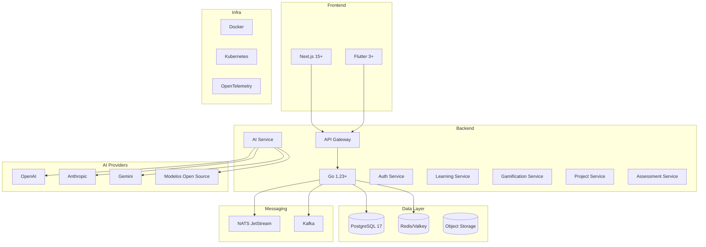
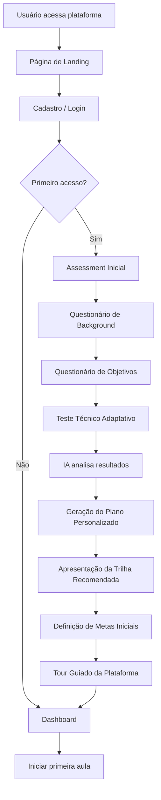
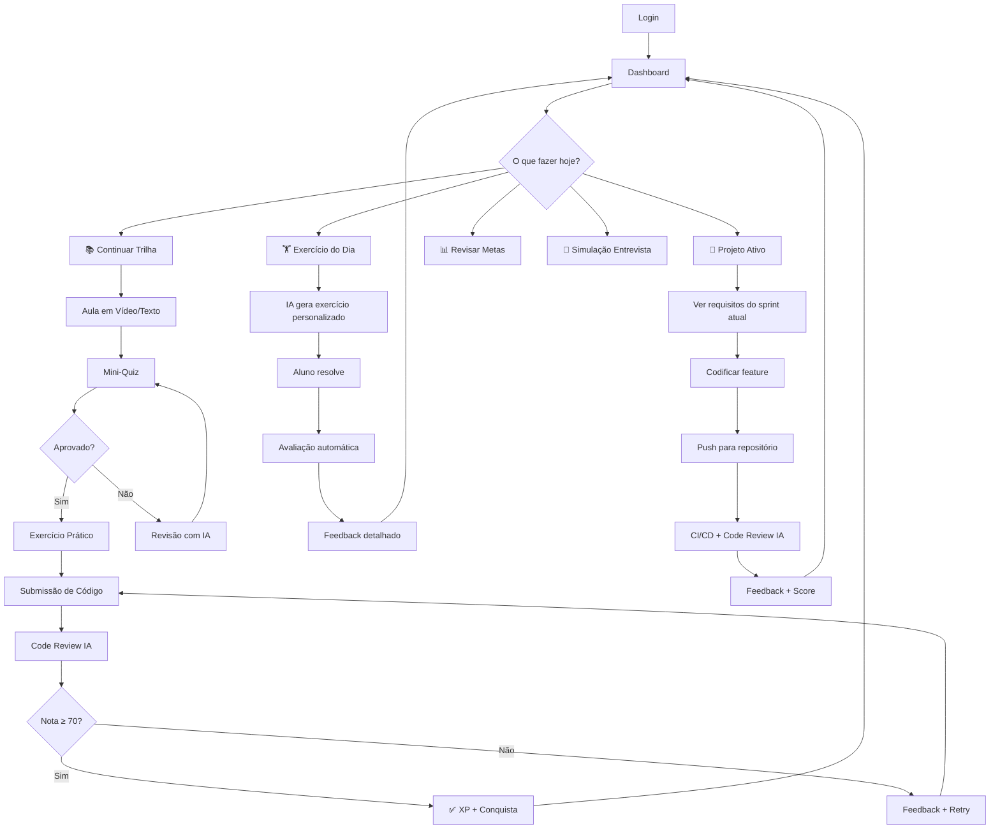
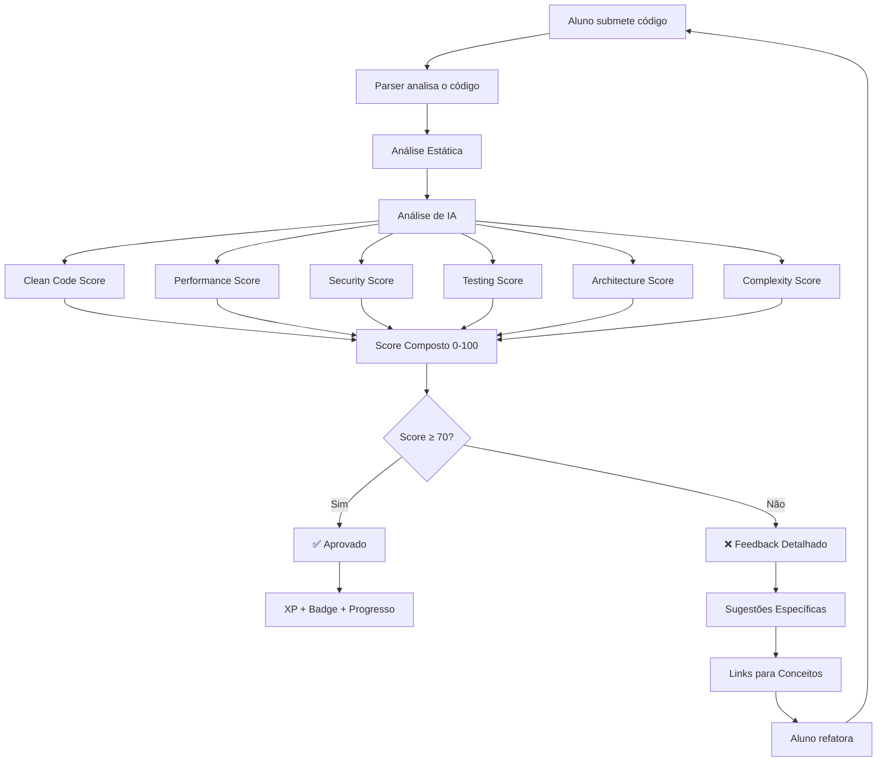
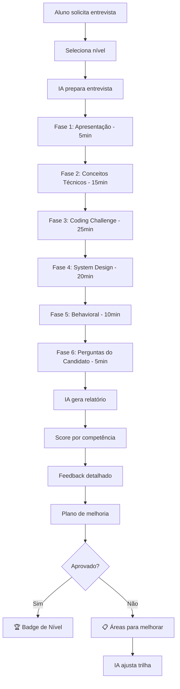
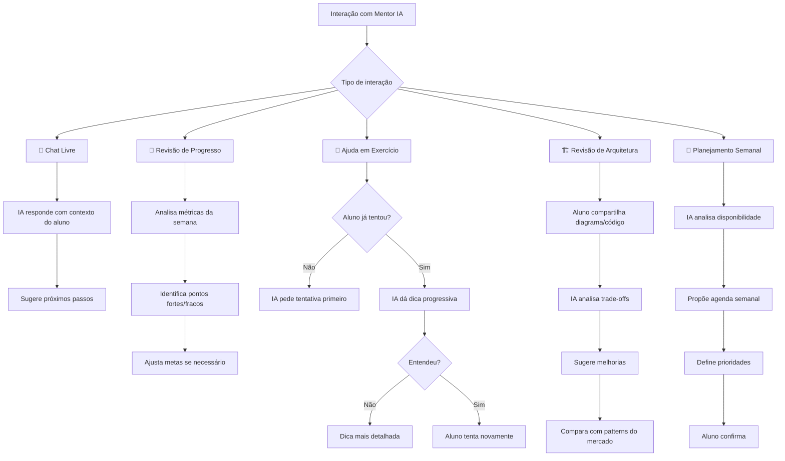
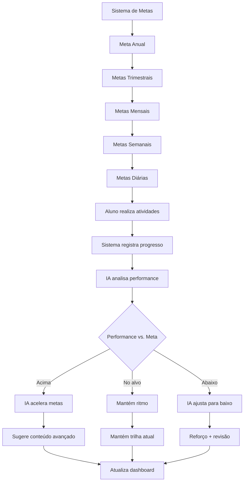
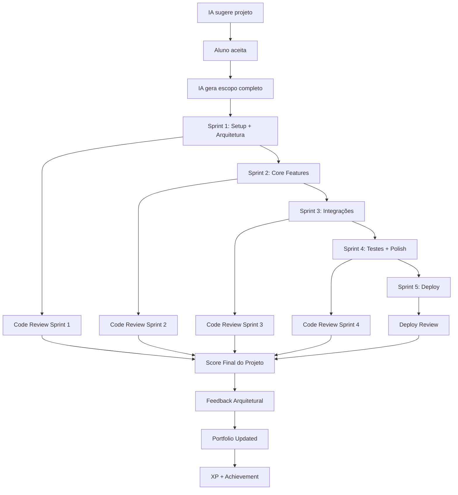
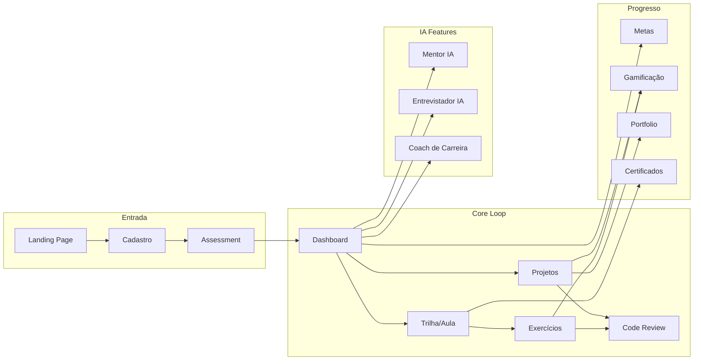

# 🌌 DEV GALÁXIAS — Documentação Oficial do Produto

## Parte 1: Visão Geral, Objetivos, Personas e Fluxos

> **Versão:** 1.0.0  
> **Data:** 15 de Junho de 2026  
> **Classificação:** Documentação Oficial de Produto  
> **Status:** Draft para Revisão

---

# 1. Visão Geral

## 1.1 O que é o DEV GALÁXIAS?

**DEV GALÁXIAS** é uma plataforma de aprendizado de engenharia de software de próxima geração, alimentada por inteligência artificial, que transforma qualquer pessoa — do absoluto zero até o nível Staff/Principal Engineer — através de uma jornada estruturada, prática, gamificada e personalizada.

A plataforma funciona simultaneamente como:

| Papel | Descrição |
|-------|-----------|
| 🏫 **Escola** | Trilhas curriculares completas com progressão pedagógica |
| 🧑‍🏫 **Professor** | Aulas interativas com explicações adaptativas por IA |
| 🧭 **Mentor** | Acompanhamento individualizado de longo prazo (anos) |
| 🏗️ **Arquiteto** | Revisão e orientação em decisões arquiteturais |
| 🔍 **Code Reviewer** | Análise automática de código com scoring multidimensional |
| 🎤 **Entrevistador** | Simulação de entrevistas técnicas reais por nível |
| 🎯 **Coach de Carreira** | Definição e ajuste de metas profissionais |
| 📋 **Gerente de Projetos** | Criação e acompanhamento de projetos progressivos |

## 1.2 Proposta de Valor

```
"De zero a Staff Engineer. Uma galáxia de conhecimento. Um mentor de IA que nunca desiste de você."
```

### Diferenciais Competitivos

1. **Jornada Completa de Carreira**: Não é um curso isolado — é um sistema que acompanha o dev por 5-10 anos
2. **IA como Coluna Vertebral**: Cada interação é personalizada, desde exercícios até entrevistas
3. **Prática > Teoria**: 70% do tempo em código real, projetos e desafios
4. **Stack Moderna e Relevante**: Go, Kubernetes, IA — tecnologias que o mercado demanda
5. **Gamificação Profunda**: XP, rankings, conquistas — motivação contínua
6. **Projetos Reais Progressivos**: De calculadora a plataforma SaaS multi-tenant
7. **Preparação para Entrevistas**: Simulações reais com IA avaliadora
8. **Code Review Automatizado**: Feedback instantâneo com scoring de 0-100

## 1.3 Stack Tecnológica



---

# 2. Objetivos

## 2.1 Objetivos de Negócio

| # | Objetivo | Métrica de Sucesso | Prazo |
|---|----------|-------------------|-------|
| O1 | Lançar MVP com trilhas 0-2 completas | 100% das aulas e exercícios funcionando | Q1 2027 |
| O2 | Atingir 1.000 usuários ativos | DAU ≥ 1.000 | Q2 2027 |
| O3 | Atingir 10.000 usuários ativos | DAU ≥ 10.000 | Q4 2027 |
| O4 | Taxa de conclusão de trilha > 40% | Completion Rate ≥ 40% | Q2 2027 |
| O5 | NPS > 70 | Pesquisa trimestral | Contínuo |
| O6 | Receita recorrente mensal (MRR) | MRR ≥ R$ 500K | Q4 2027 |

## 2.2 Objetivos de Produto

| # | Objetivo | Critério |
|---|----------|----------|
| P1 | Personalização total da jornada | IA adapta conteúdo, ritmo e dificuldade individualmente |
| P2 | Feedback instantâneo em código | < 30s para code review automatizado |
| P3 | Projetos com deploy real | Aluno faz deploy em ambiente cloud real |
| P4 | Preparação para mercado | Alunos aprovados em entrevistas técnicas reais |
| P5 | Retenção de longo prazo | Usuário ativo por ≥ 12 meses |
| P6 | Acessibilidade | Funcionar em conexões de 1Mbps+ |

## 2.3 Objetivos Educacionais

| # | Objetivo | Medição |
|---|----------|---------|
| E1 | Formar desenvolvedores Júnior em 6-12 meses | Assessment + Projeto final |
| E2 | Desenvolvedores Júnior → Pleno em 12-18 meses | Avaliação de competências + Portfolio |
| E3 | Desenvolvedores Pleno → Sênior em 18-24 meses | Projetos complexos + Entrevistas |
| E4 | Desenvolvedores Sênior → Staff em 24-36 meses | Liderança técnica + Arquitetura |
| E5 | Garantir proficiência em Go, Cloud e IA | Testes práticos com nota ≥ 80 |
| E6 | Construir portfolio com ≥ 10 projetos reais | Projetos deployados e funcionais |

## 2.4 Objetivos Técnicos

| # | Objetivo | SLA |
|---|----------|-----|
| T1 | Disponibilidade | 99.9% uptime |
| T2 | Latência de API | p99 < 200ms |
| T3 | Latência de IA | p99 < 10s para respostas completas |
| T4 | Escalabilidade | Suportar 100K usuários concorrentes |
| T5 | Segurança | SOC2 Type II compliance |
| T6 | Observabilidade | 100% de traces distribuídos |

---

# 3. Personas

## 3.1 Persona Primária: Ana "Zero Code"

```
┌─────────────────────────────────────────────┐
│  👩 Ana, 24 anos — São Paulo, SP            │
│  Formação: Administração                     │
│  Experiência em dev: Nenhuma                 │
│  Renda: R$ 3.000/mês                        │
│  Objetivo: Transição de carreira para dev    │
│  Motivação: Salário, flexibilidade, futuro   │
│  Frustração: Cursos superficiais, sem rumo   │
│  Disponibilidade: 3h/dia                     │
│  Dispositivo: Notebook básico + Celular      │
└─────────────────────────────────────────────┘
```

**Jornada Esperada:**
- Nível 0 → Nível 2 em 8 meses
- Primeiro emprego como Júnior em 10-12 meses
- Precisa de: Guia passo-a-passo, exercícios graduais, motivação constante

**Dores:**
- "Não sei por onde começar"
- "Tentei vários cursos e desisti"
- "Não entendo o que estudar primeiro"
- "Não tenho ninguém para tirar dúvidas"

**Necessidades da Plataforma:**
- Onboarding extremamente guiado
- Exercícios com dificuldade progressiva muito suave
- Mentor IA que nunca dá resposta pronta, mas guia
- Gamificação forte para manter engajamento
- Projetos simples que geram sensação de conquista

---

## 3.2 Persona Secundária: Carlos "Júnior Frustrado"

```
┌─────────────────────────────────────────────┐
│  👨 Carlos, 27 anos — Belo Horizonte, MG    │
│  Formação: Ciência da Computação             │
│  Experiência: 1.5 anos como dev Júnior       │
│  Stack atual: JavaScript/Node.js             │
│  Renda: R$ 4.500/mês                        │
│  Objetivo: Virar Pleno e aprender Go         │
│  Motivação: Crescimento técnico e salarial   │
│  Frustração: Estagnado no mesmo nível        │
│  Disponibilidade: 2h/dia                     │
│  Dispositivo: MacBook + iPhone               │
└─────────────────────────────────────────────┘
```

**Jornada Esperada:**
- Pular Nível 0, iniciar no Nível 1 (Go) após assessment
- Nível 1 → Nível 4 em 12 meses
- Promoção para Pleno em 12-18 meses

**Dores:**
- "Sei programar mas não sei arquitetura"
- "Meu código funciona mas não sei se é bom"
- "Não sei o que estudar para virar Pleno"
- "Quero aprender Go mas não sei como migrar"

**Necessidades da Plataforma:**
- Assessment inicial para calibrar nível
- Code review automático nos projetos atuais
- Trilha focada em arquitetura e boas práticas
- Simulações de entrevista para Pleno
- Projetos mais complexos (API REST → CRM)

---

## 3.3 Persona Terciária: Marina "Sênior Ambiciosa"

```
┌─────────────────────────────────────────────┐
│  👩‍💻 Marina, 32 anos — Remote (Portugal)    │
│  Formação: Engenharia de Software            │
│  Experiência: 7 anos, Sênior em Java         │
│  Stack atual: Java/Spring Boot/AWS           │
│  Renda: €5.000/mês                          │
│  Objetivo: Virar Staff Engineer              │
│  Motivação: Impacto técnico, liderança       │
│  Frustração: Não sabe o gap para Staff       │
│  Disponibilidade: 1.5h/dia                   │
│  Dispositivo: MacBook Pro + iPad             │
└─────────────────────────────────────────────┘
```

**Jornada Esperada:**
- Ingressar nos Níveis 4-5 (Arquitetura + Cloud)
- Complementar com Nível 8 (IA) e Nível 9 (Staff)
- Transição para Staff em 18-24 meses

**Dores:**
- "O que diferencia Sênior de Staff?"
- "Preciso melhorar em sistemas distribuídos"
- "Quero aprender Go e Kubernetes de verdade"
- "Preciso de alguém que avalie minha arquitetura"

**Necessidades da Plataforma:**
- Desafios de arquitetura de sistemas distribuídos
- Mentoria IA focada em decisões de design
- Projetos nível Staff (SaaS multi-tenant, plataformas de IA)
- Entrevistas simuladas para Staff/Principal
- Conteúdo sobre liderança técnica e RFCs

---

## 3.4 Persona Quaternária: Diego "Tech Lead em Transição"

```
┌─────────────────────────────────────────────┐
│  👨‍💼 Diego, 35 anos — São Paulo, SP         │
│  Formação: Sistemas de Informação            │
│  Experiência: 10 anos, Tech Lead             │
│  Stack atual: Python/Django/AWS              │
│  Renda: R$ 25.000/mês                       │
│  Objetivo: Principal Engineer + IA           │
│  Motivação: Manter relevância, IA é futuro   │
│  Frustração: IA está mudando tudo, preciso   │
│              me adaptar                       │
│  Disponibilidade: 1h/dia                     │
│  Dispositivo: Setup completo                 │
└─────────────────────────────────────────────┘
```

**Jornada Esperada:**
- Focar nos Níveis 8-9 (IA + Staff/Principal)
- Complementar com Go e Kubernetes
- Evolução para Principal Engineer em 24-36 meses

**Necessidades da Plataforma:**
- Conteúdo avançado de IA (RAG, Agentes, MCP)
- Projetos de plataforma de IA multiagente
- Avaliação de liderança técnica e tomada de decisão
- Mentoria IA para decisões estratégicas de arquitetura

---

# 4. Fluxos do Usuário

## 4.1 Fluxo de Onboarding



### 4.1.1 Detalhamento do Assessment Inicial

**Questionário de Background (5 min):**
```
1. Qual sua experiência com programação?
   [ ] Nunca programei
   [ ] Conheço lógica básica
   [ ] Programo há menos de 1 ano
   [ ] Programo há 1-3 anos
   [ ] Programo há 3-5 anos
   [ ] Programo há 5+ anos

2. Quais linguagens você já usou?
   [ ] Nenhuma  [ ] Python  [ ] JavaScript  [ ] Java
   [ ] Go       [ ] C/C++   [ ] TypeScript  [ ] Outras

3. Qual seu objetivo principal?
   [ ] Transição de carreira
   [ ] Conseguir primeiro emprego
   [ ] Crescer de Júnior para Pleno
   [ ] Crescer de Pleno para Sênior
   [ ] Atingir Staff/Principal Engineer
   [ ] Aprender tecnologias específicas

4. Quantas horas por dia pode dedicar?
   [ ] 1h  [ ] 2h  [ ] 3h  [ ] 4h+

5. Em quanto tempo quer atingir seu objetivo?
   [ ] 6 meses  [ ] 12 meses  [ ] 18 meses  [ ] 24+ meses
```

**Teste Técnico Adaptativo (15-30 min):**
- Começa com questões de lógica básica
- Adapta dificuldade baseado nas respostas
- Cobre: lógica, algoritmos, SQL, API, arquitetura (conforme nível)
- Máximo de 30 questões (para de adaptar quando calibra o nível)

---

## 4.2 Fluxo de Aprendizado Diário



---

## 4.3 Fluxo de Code Review



### 4.3.1 Dimensões de Avaliação

| Dimensão | Peso | O que avalia |
|----------|------|-------------|
| Clean Code | 25% | Nomenclatura, funções curtas, SRP, legibilidade |
| Performance | 15% | Complexidade algorítmica, uso de memória, otimizações |
| Segurança | 15% | SQL injection, XSS, secrets expostos, validação de input |
| Testes | 20% | Cobertura, qualidade dos testes, edge cases |
| Arquitetura | 15% | Separação de camadas, DI, patterns corretos |
| Complexidade | 10% | Complexidade ciclomática, acoplamento, coesão |

---

## 4.4 Fluxo de Entrevista Técnica



---

## 4.5 Fluxo de Mentoria IA



### 4.5.1 Regras do Mentor IA

> [!IMPORTANT]
> O Mentor IA **NUNCA** entrega respostas prontas. Ele sempre guia o aluno através de:

1. **Método Socrático**: Faz perguntas que levam o aluno à resposta
2. **Dicas Progressivas**: Começa com dica vaga, vai detalhando conforme necessário
3. **Contextualização**: Sempre relaciona com conceitos já aprendidos pelo aluno
4. **Encorajamento**: Celebra progresso, normaliza erros, mantém motivação
5. **Desafio Calibrado**: Empurra o aluno para fora da zona de conforto, mas não tanto que desmotive

**Níveis de Dica:**
```
Nível 1: "Pense em como você resolveria isso com um loop..."
Nível 2: "Que tipo de estrutura de dados permite busca O(1)?"
Nível 3: "Um HashMap seria útil aqui. Como você usaria?"
Nível 4: "Crie um map[string]int e itere sobre o slice..."
Nível 5: [Mostra pseudocódigo, nunca código completo pronto]
```

---

## 4.6 Fluxo de Metas e Progresso



---

## 4.7 Fluxo de Projeto



---

## 4.8 Mapa Completo de Fluxos


