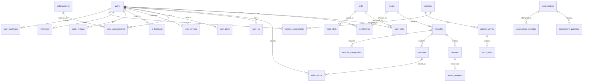

# 🌌 DEV GALÁXIAS — Documentação Oficial do Produto

## Parte 3: Estrutura de Banco de Dados

> **Versão:** 1.0.0  
> **Data:** 15 de Junho de 2026

---

# 6. Estrutura de Banco de Dados

## 6.1 Diagrama Entidade-Relacionamento (ER)



## 6.2 Tabelas Detalhadas

### 6.2.1 `users` — Usuários

```sql
CREATE TABLE users (
    id              UUID PRIMARY KEY DEFAULT gen_random_uuid(),
    email           VARCHAR(255) NOT NULL UNIQUE,
    password_hash   VARCHAR(255) NOT NULL,
    full_name       VARCHAR(255) NOT NULL,
    display_name    VARCHAR(100),
    avatar_url      TEXT,
    bio             TEXT,
    
    -- Nível e XP
    current_level   INTEGER NOT NULL DEFAULT 1,
    total_xp        BIGINT NOT NULL DEFAULT 0,
    
    -- Perfil de Aprendizado
    experience_level    VARCHAR(50) NOT NULL DEFAULT 'beginner',
        -- beginner, junior, mid, senior, staff, principal
    primary_goal        VARCHAR(100),
    daily_hours         DECIMAL(3,1) DEFAULT 2.0,
    preferred_language  VARCHAR(50) DEFAULT 'pt-BR',
    learning_style      VARCHAR(50) DEFAULT 'practical',
        -- practical, theoretical, visual, mixed
    timezone            VARCHAR(50) DEFAULT 'America/Sao_Paulo',
    
    -- Status
    status          VARCHAR(20) NOT NULL DEFAULT 'active',
        -- active, inactive, suspended, deleted
    email_verified  BOOLEAN NOT NULL DEFAULT FALSE,
    onboarding_completed BOOLEAN NOT NULL DEFAULT FALSE,
    
    -- OAuth
    google_id       VARCHAR(255),
    github_id       VARCHAR(255),
    
    -- Timestamps
    created_at      TIMESTAMPTZ NOT NULL DEFAULT NOW(),
    updated_at      TIMESTAMPTZ NOT NULL DEFAULT NOW(),
    last_login_at   TIMESTAMPTZ,
    deleted_at      TIMESTAMPTZ,
    
    -- Constraints
    CONSTRAINT chk_experience_level CHECK (
        experience_level IN ('beginner', 'junior', 'mid', 'senior', 'staff', 'principal')
    ),
    CONSTRAINT chk_status CHECK (
        status IN ('active', 'inactive', 'suspended', 'deleted')
    )
);

CREATE INDEX idx_users_email ON users(email);
CREATE INDEX idx_users_status ON users(status) WHERE deleted_at IS NULL;
CREATE INDEX idx_users_level ON users(current_level);
CREATE INDEX idx_users_total_xp ON users(total_xp DESC);
CREATE INDEX idx_users_google_id ON users(google_id) WHERE google_id IS NOT NULL;
CREATE INDEX idx_users_github_id ON users(github_id) WHERE github_id IS NOT NULL;
```

---

### 6.2.2 `skills` — Habilidades

```sql
CREATE TABLE skills (
    id              UUID PRIMARY KEY DEFAULT gen_random_uuid(),
    name            VARCHAR(100) NOT NULL UNIQUE,
    slug            VARCHAR(100) NOT NULL UNIQUE,
    category        VARCHAR(50) NOT NULL,
        -- language, database, infrastructure, architecture, ai, soft_skill
    description     TEXT,
    icon_url        TEXT,
    max_level       INTEGER NOT NULL DEFAULT 10,
    
    created_at      TIMESTAMPTZ NOT NULL DEFAULT NOW(),
    updated_at      TIMESTAMPTZ NOT NULL DEFAULT NOW()
);

-- Exemplos de skills:
-- Go, PostgreSQL, Docker, Kubernetes, Redis, NATS, Clean Architecture,
-- DDD, CQRS, System Design, Testing, CI/CD, Observability, RAG, MCP

CREATE INDEX idx_skills_category ON skills(category);
CREATE INDEX idx_skills_slug ON skills(slug);
```

---

### 6.2.3 `user_skills` — Habilidades do Usuário

```sql
CREATE TABLE user_skills (
    id              UUID PRIMARY KEY DEFAULT gen_random_uuid(),
    user_id         UUID NOT NULL REFERENCES users(id) ON DELETE CASCADE,
    skill_id        UUID NOT NULL REFERENCES skills(id),
    
    current_level   INTEGER NOT NULL DEFAULT 0, -- 0-10
    xp_in_skill     INTEGER NOT NULL DEFAULT 0,
    
    -- Última avaliação
    last_assessed_at    TIMESTAMPTZ,
    last_assessed_score DECIMAL(5,2),
    
    created_at      TIMESTAMPTZ NOT NULL DEFAULT NOW(),
    updated_at      TIMESTAMPTZ NOT NULL DEFAULT NOW(),
    
    CONSTRAINT uq_user_skill UNIQUE (user_id, skill_id),
    CONSTRAINT chk_skill_level CHECK (current_level >= 0 AND current_level <= 10)
);

CREATE INDEX idx_user_skills_user ON user_skills(user_id);
CREATE INDEX idx_user_skills_skill ON user_skills(skill_id);
```

---

### 6.2.4 `tracks` — Trilhas de Aprendizado

```sql
CREATE TABLE tracks (
    id              UUID PRIMARY KEY DEFAULT gen_random_uuid(),
    name            VARCHAR(255) NOT NULL,
    slug            VARCHAR(255) NOT NULL UNIQUE,
    description     TEXT NOT NULL,
    long_description TEXT,
    
    -- Nível da trilha
    level           INTEGER NOT NULL, -- 0-9
    difficulty      VARCHAR(20) NOT NULL,
        -- beginner, intermediate, advanced, expert
    
    -- Metadados
    estimated_hours INTEGER NOT NULL, -- Horas estimadas
    total_modules   INTEGER NOT NULL DEFAULT 0,
    total_lessons   INTEGER NOT NULL DEFAULT 0,
    total_exercises INTEGER NOT NULL DEFAULT 0,
    
    -- Visual
    icon_url        TEXT,
    cover_url       TEXT,
    color           VARCHAR(7), -- Hex color
    
    -- Status
    status          VARCHAR(20) NOT NULL DEFAULT 'draft',
        -- draft, published, archived
    published_at    TIMESTAMPTZ,
    
    -- Ordenação
    sort_order      INTEGER NOT NULL DEFAULT 0,
    
    created_at      TIMESTAMPTZ NOT NULL DEFAULT NOW(),
    updated_at      TIMESTAMPTZ NOT NULL DEFAULT NOW(),
    
    CONSTRAINT chk_track_level CHECK (level >= 0 AND level <= 9),
    CONSTRAINT chk_difficulty CHECK (
        difficulty IN ('beginner', 'intermediate', 'advanced', 'expert')
    )
);

CREATE INDEX idx_tracks_level ON tracks(level);
CREATE INDEX idx_tracks_status ON tracks(status);
CREATE INDEX idx_tracks_sort ON tracks(sort_order);
```

---

### 6.2.5 `track_skills` — Skills por Trilha

```sql
CREATE TABLE track_skills (
    id          UUID PRIMARY KEY DEFAULT gen_random_uuid(),
    track_id    UUID NOT NULL REFERENCES tracks(id) ON DELETE CASCADE,
    skill_id    UUID NOT NULL REFERENCES skills(id),
    
    -- Quanto essa trilha contribui para a skill (0-100%)
    contribution_weight DECIMAL(5,2) NOT NULL DEFAULT 0,
    
    CONSTRAINT uq_track_skill UNIQUE (track_id, skill_id)
);

CREATE INDEX idx_track_skills_track ON track_skills(track_id);
```

---

### 6.2.6 `track_prerequisites` — Pré-requisitos de Trilha

```sql
CREATE TABLE track_prerequisites (
    id                  UUID PRIMARY KEY DEFAULT gen_random_uuid(),
    track_id            UUID NOT NULL REFERENCES tracks(id) ON DELETE CASCADE,
    prerequisite_track_id UUID NOT NULL REFERENCES tracks(id),
    
    -- Pode ser soft (recomendado) ou hard (obrigatório)
    requirement_type    VARCHAR(10) NOT NULL DEFAULT 'hard',
    
    CONSTRAINT uq_track_prereq UNIQUE (track_id, prerequisite_track_id),
    CONSTRAINT chk_no_self_prereq CHECK (track_id != prerequisite_track_id),
    CONSTRAINT chk_requirement_type CHECK (
        requirement_type IN ('hard', 'soft')
    )
);
```

---

### 6.2.7 `modules` — Módulos

```sql
CREATE TABLE modules (
    id              UUID PRIMARY KEY DEFAULT gen_random_uuid(),
    track_id        UUID NOT NULL REFERENCES tracks(id) ON DELETE CASCADE,
    
    name            VARCHAR(255) NOT NULL,
    slug            VARCHAR(255) NOT NULL,
    description     TEXT,
    
    -- Metadados
    estimated_hours DECIMAL(4,1) NOT NULL,
    sort_order      INTEGER NOT NULL,
    total_lessons   INTEGER NOT NULL DEFAULT 0,
    total_exercises INTEGER NOT NULL DEFAULT 0,
    
    -- Critérios de aprovação
    min_score       INTEGER NOT NULL DEFAULT 70, -- Score mínimo para passar
    min_exercises   INTEGER NOT NULL DEFAULT 0,  -- Exercícios mínimos
    requires_project BOOLEAN NOT NULL DEFAULT FALSE,
    
    -- Status
    status          VARCHAR(20) NOT NULL DEFAULT 'draft',
    
    created_at      TIMESTAMPTZ NOT NULL DEFAULT NOW(),
    updated_at      TIMESTAMPTZ NOT NULL DEFAULT NOW(),
    
    CONSTRAINT uq_module_slug_track UNIQUE (track_id, slug)
);

CREATE INDEX idx_modules_track ON modules(track_id);
CREATE INDEX idx_modules_sort ON modules(track_id, sort_order);
```

---

### 6.2.8 `module_prerequisites` — Pré-requisitos de Módulo

```sql
CREATE TABLE module_prerequisites (
    id                      UUID PRIMARY KEY DEFAULT gen_random_uuid(),
    module_id               UUID NOT NULL REFERENCES modules(id) ON DELETE CASCADE,
    prerequisite_module_id  UUID NOT NULL REFERENCES modules(id),
    
    CONSTRAINT uq_module_prereq UNIQUE (module_id, prerequisite_module_id),
    CONSTRAINT chk_no_self_module_prereq CHECK (module_id != prerequisite_module_id)
);
```

---

### 6.2.9 `lessons` — Aulas

```sql
CREATE TABLE lessons (
    id              UUID PRIMARY KEY DEFAULT gen_random_uuid(),
    module_id       UUID NOT NULL REFERENCES modules(id) ON DELETE CASCADE,
    
    title           VARCHAR(255) NOT NULL,
    slug            VARCHAR(255) NOT NULL,
    description     TEXT,
    
    -- Conteúdo
    content_type    VARCHAR(20) NOT NULL,
        -- text, video, interactive, sandbox, quiz
    content_body    JSONB, -- Conteúdo estruturado
    video_url       TEXT,
    video_duration  INTEGER, -- Segundos
    
    -- Metadados
    estimated_minutes INTEGER NOT NULL DEFAULT 15,
    sort_order      INTEGER NOT NULL,
    difficulty      VARCHAR(20) NOT NULL DEFAULT 'beginner',
    xp_reward       INTEGER NOT NULL DEFAULT 10,
    
    -- Quiz inline (se houver)
    has_quiz        BOOLEAN NOT NULL DEFAULT FALSE,
    quiz_data       JSONB, -- Perguntas e respostas
    min_quiz_score  INTEGER DEFAULT 70,
    
    -- Status
    status          VARCHAR(20) NOT NULL DEFAULT 'draft',
    
    created_at      TIMESTAMPTZ NOT NULL DEFAULT NOW(),
    updated_at      TIMESTAMPTZ NOT NULL DEFAULT NOW(),
    
    CONSTRAINT uq_lesson_slug_module UNIQUE (module_id, slug)
);

CREATE INDEX idx_lessons_module ON lessons(module_id);
CREATE INDEX idx_lessons_sort ON lessons(module_id, sort_order);
```

**Estrutura do `content_body` (JSONB):**
```json
{
  "sections": [
    {
      "type": "text",
      "title": "O que são Goroutines?",
      "content": "Goroutines são threads leves gerenciadas pelo runtime do Go..."
    },
    {
      "type": "code",
      "language": "go",
      "code": "go func() {\n  fmt.Println(\"Hello\")\n}()",
      "executable": true,
      "expected_output": "Hello"
    },
    {
      "type": "diagram",
      "diagram_type": "mermaid",
      "content": "graph LR\n  A-->B"
    },
    {
      "type": "mini_exercise",
      "prompt": "Crie uma goroutine que imprime os números de 1 a 10",
      "tests": "..."
    }
  ]
}
```

---

### 6.2.10 `lesson_progress` — Progresso de Aulas

```sql
CREATE TABLE lesson_progress (
    id              UUID PRIMARY KEY DEFAULT gen_random_uuid(),
    user_id         UUID NOT NULL REFERENCES users(id) ON DELETE CASCADE,
    lesson_id       UUID NOT NULL REFERENCES lessons(id),
    
    status          VARCHAR(20) NOT NULL DEFAULT 'not_started',
        -- not_started, in_progress, completed
    
    -- Quiz
    quiz_score      INTEGER,
    quiz_attempts   INTEGER NOT NULL DEFAULT 0,
    
    -- Tempo
    started_at      TIMESTAMPTZ,
    completed_at    TIMESTAMPTZ,
    time_spent_seconds INTEGER NOT NULL DEFAULT 0,
    
    -- XP ganho nesta aula
    xp_earned       INTEGER NOT NULL DEFAULT 0,
    
    created_at      TIMESTAMPTZ NOT NULL DEFAULT NOW(),
    updated_at      TIMESTAMPTZ NOT NULL DEFAULT NOW(),
    
    CONSTRAINT uq_user_lesson UNIQUE (user_id, lesson_id)
);

CREATE INDEX idx_lesson_progress_user ON lesson_progress(user_id);
CREATE INDEX idx_lesson_progress_lesson ON lesson_progress(lesson_id);
CREATE INDEX idx_lesson_progress_status ON lesson_progress(user_id, status);
```

---

### 6.2.11 `exercises` — Exercícios

```sql
CREATE TABLE exercises (
    id              UUID PRIMARY KEY DEFAULT gen_random_uuid(),
    module_id       UUID REFERENCES modules(id) ON DELETE SET NULL,
    
    title           VARCHAR(255) NOT NULL,
    slug            VARCHAR(255) NOT NULL UNIQUE,
    description     TEXT NOT NULL,
    
    -- Tipo e dificuldade
    exercise_type   VARCHAR(20) NOT NULL,
        -- coding, multiple_choice, fill_blank, debug, refactor, design
    difficulty      VARCHAR(20) NOT NULL,
        -- easy, medium, hard, expert
    language        VARCHAR(50) NOT NULL DEFAULT 'go',
    
    -- Conteúdo
    problem_statement TEXT NOT NULL,      -- Enunciado completo
    hints           JSONB,               -- Array de dicas progressivas
    starter_code    TEXT,                 -- Código inicial (template)
    solution_code   TEXT,                 -- Solução de referência
    explanation     TEXT,                 -- Explicação da solução
    
    -- Testes
    test_cases      JSONB NOT NULL,      -- Testes automáticos
    hidden_tests    JSONB,               -- Testes ocultos (anti-cheat)
    
    -- Avaliação
    evaluation_criteria JSONB NOT NULL,  -- Critérios de avaliação
    max_score       INTEGER NOT NULL DEFAULT 100,
    passing_score   INTEGER NOT NULL DEFAULT 70,
    
    -- XP
    xp_reward       INTEGER NOT NULL DEFAULT 10,
    xp_bonus_first_try INTEGER NOT NULL DEFAULT 5,
    
    -- Metadados
    tags            TEXT[] DEFAULT '{}',
    estimated_minutes INTEGER NOT NULL DEFAULT 15,
    max_attempts    INTEGER, -- NULL = ilimitado
    
    -- IA
    ai_generated    BOOLEAN NOT NULL DEFAULT FALSE,
    ai_model        VARCHAR(100),
    ai_prompt_hash  VARCHAR(64),
    
    -- Status
    status          VARCHAR(20) NOT NULL DEFAULT 'draft',
    
    created_at      TIMESTAMPTZ NOT NULL DEFAULT NOW(),
    updated_at      TIMESTAMPTZ NOT NULL DEFAULT NOW()
);

CREATE INDEX idx_exercises_module ON exercises(module_id);
CREATE INDEX idx_exercises_difficulty ON exercises(difficulty);
CREATE INDEX idx_exercises_type ON exercises(exercise_type);
CREATE INDEX idx_exercises_language ON exercises(language);
CREATE INDEX idx_exercises_tags ON exercises USING GIN(tags);
CREATE INDEX idx_exercises_status ON exercises(status);
```

**Estrutura do `test_cases` (JSONB):**
```json
{
  "tests": [
    {
      "name": "Test_BasicAddition",
      "input": "2, 3",
      "expected_output": "5",
      "timeout_ms": 5000,
      "is_hidden": false
    },
    {
      "name": "Test_NegativeNumbers",
      "input": "-5, 3",
      "expected_output": "-2",
      "timeout_ms": 5000,
      "is_hidden": true
    }
  ]
}
```

**Estrutura do `hints` (JSONB):**
```json
{
  "hints": [
    {
      "level": 1,
      "text": "Pense em como você iteraria sobre os elementos...",
      "xp_penalty": 0
    },
    {
      "level": 2,
      "text": "Um map[string]int poderia ajudar a contar frequências",
      "xp_penalty": 2
    },
    {
      "level": 3,
      "text": "Crie o map, itere com range, e incremente o contador",
      "xp_penalty": 5
    }
  ]
}
```

**Estrutura do `evaluation_criteria` (JSONB):**
```json
{
  "criteria": [
    {
      "name": "correctness",
      "weight": 40,
      "description": "Todos os testes passam"
    },
    {
      "name": "clean_code",
      "weight": 25,
      "description": "Nomenclatura, organização, legibilidade"
    },
    {
      "name": "performance",
      "weight": 15,
      "description": "Complexidade algorítmica adequada"
    },
    {
      "name": "testing",
      "weight": 20,
      "description": "Testes unitários do aluno"
    }
  ]
}
```

---

### 6.2.12 `submissions` — Submissões

```sql
CREATE TABLE submissions (
    id              UUID PRIMARY KEY DEFAULT gen_random_uuid(),
    user_id         UUID NOT NULL REFERENCES users(id) ON DELETE CASCADE,
    exercise_id     UUID NOT NULL REFERENCES exercises(id),
    
    -- Código submetido
    code            TEXT NOT NULL,
    language        VARCHAR(50) NOT NULL DEFAULT 'go',
    
    -- Resultados
    status          VARCHAR(20) NOT NULL DEFAULT 'pending',
        -- pending, running, passed, failed, error, timeout
    
    -- Scores
    total_score     INTEGER,
    correctness_score INTEGER,
    clean_code_score  INTEGER,
    performance_score INTEGER,
    testing_score     INTEGER,
    security_score    INTEGER,
    architecture_score INTEGER,
    
    -- Testes
    tests_passed    INTEGER NOT NULL DEFAULT 0,
    tests_total     INTEGER NOT NULL DEFAULT 0,
    test_results    JSONB,
    
    -- Análise estática
    lint_issues     JSONB,
    lint_score      INTEGER,
    
    -- Feedback da IA
    ai_feedback     TEXT,
    ai_suggestions  JSONB,
    ai_model_used   VARCHAR(100),
    
    -- Metadados
    attempt_number  INTEGER NOT NULL DEFAULT 1,
    execution_time_ms INTEGER,
    memory_used_kb  INTEGER,
    hints_used      INTEGER NOT NULL DEFAULT 0,
    
    -- XP
    xp_earned       INTEGER NOT NULL DEFAULT 0,
    
    -- Timestamps
    submitted_at    TIMESTAMPTZ NOT NULL DEFAULT NOW(),
    evaluated_at    TIMESTAMPTZ,
    
    created_at      TIMESTAMPTZ NOT NULL DEFAULT NOW()
);

CREATE INDEX idx_submissions_user ON submissions(user_id);
CREATE INDEX idx_submissions_exercise ON submissions(exercise_id);
CREATE INDEX idx_submissions_user_exercise ON submissions(user_id, exercise_id);
CREATE INDEX idx_submissions_status ON submissions(status);
CREATE INDEX idx_submissions_score ON submissions(total_score DESC);
CREATE INDEX idx_submissions_date ON submissions(submitted_at DESC);
```

---

### 6.2.13 `projects` — Projetos

```sql
CREATE TABLE projects (
    id              UUID PRIMARY KEY DEFAULT gen_random_uuid(),
    
    name            VARCHAR(255) NOT NULL,
    slug            VARCHAR(255) NOT NULL UNIQUE,
    description     TEXT NOT NULL,
    long_description TEXT,
    
    -- Classificação
    difficulty_level VARCHAR(20) NOT NULL,
        -- beginner, junior, mid, senior, staff, principal
    category        VARCHAR(50) NOT NULL,
        -- cli, api, web, mobile, fullstack, distributed, ai
    
    -- Especificação
    requirements    JSONB NOT NULL,     -- Requisitos funcionais
    non_functional  JSONB,              -- Requisitos não-funcionais
    architecture    JSONB,              -- Arquitetura sugerida
    database_schema JSONB,              -- Schema sugerido
    api_spec        JSONB,              -- API spec
    acceptance_criteria JSONB NOT NULL, -- Critérios de aceitação
    
    -- Metadados
    estimated_weeks INTEGER NOT NULL,
    total_sprints   INTEGER NOT NULL,
    technologies    TEXT[] DEFAULT '{}',
    skills_required UUID[] DEFAULT '{}',
    
    -- XP
    xp_reward       INTEGER NOT NULL DEFAULT 1000,
    xp_per_sprint   INTEGER NOT NULL DEFAULT 200,
    
    -- Deploy
    deploy_guide    JSONB,              -- Guia de deploy
    requires_deploy BOOLEAN NOT NULL DEFAULT FALSE,
    
    -- Status
    status          VARCHAR(20) NOT NULL DEFAULT 'draft',
    
    -- IA
    ai_generated    BOOLEAN NOT NULL DEFAULT FALSE,
    
    created_at      TIMESTAMPTZ NOT NULL DEFAULT NOW(),
    updated_at      TIMESTAMPTZ NOT NULL DEFAULT NOW()
);

CREATE INDEX idx_projects_difficulty ON projects(difficulty_level);
CREATE INDEX idx_projects_category ON projects(category);
CREATE INDEX idx_projects_status ON projects(status);
CREATE INDEX idx_projects_technologies ON projects USING GIN(technologies);
```

---

### 6.2.14 `project_assignments` — Projetos Atribuídos

```sql
CREATE TABLE project_assignments (
    id              UUID PRIMARY KEY DEFAULT gen_random_uuid(),
    user_id         UUID NOT NULL REFERENCES users(id) ON DELETE CASCADE,
    project_id      UUID NOT NULL REFERENCES projects(id),
    
    -- Status
    status          VARCHAR(20) NOT NULL DEFAULT 'assigned',
        -- assigned, in_progress, review, completed, abandoned
    
    -- Repositório
    repo_url        TEXT,
    deploy_url      TEXT,
    
    -- Scores
    final_score     INTEGER,
    code_quality_score INTEGER,
    architecture_score INTEGER,
    testing_score   INTEGER,
    deploy_score    INTEGER,
    
    -- Progresso
    current_sprint  INTEGER NOT NULL DEFAULT 1,
    sprints_completed INTEGER NOT NULL DEFAULT 0,
    
    -- XP
    total_xp_earned INTEGER NOT NULL DEFAULT 0,
    
    -- Feedback
    final_feedback  TEXT,
    
    -- Timestamps
    assigned_at     TIMESTAMPTZ NOT NULL DEFAULT NOW(),
    started_at      TIMESTAMPTZ,
    completed_at    TIMESTAMPTZ,
    
    created_at      TIMESTAMPTZ NOT NULL DEFAULT NOW(),
    updated_at      TIMESTAMPTZ NOT NULL DEFAULT NOW(),
    
    CONSTRAINT uq_user_project UNIQUE (user_id, project_id)
);

CREATE INDEX idx_project_assignments_user ON project_assignments(user_id);
CREATE INDEX idx_project_assignments_status ON project_assignments(status);
```

---

### 6.2.15 `project_sprints` — Sprints de Projetos

```sql
CREATE TABLE project_sprints (
    id              UUID PRIMARY KEY DEFAULT gen_random_uuid(),
    project_id      UUID NOT NULL REFERENCES projects(id) ON DELETE CASCADE,
    
    sprint_number   INTEGER NOT NULL,
    name            VARCHAR(255) NOT NULL,
    description     TEXT,
    objectives      JSONB NOT NULL,
    deliverables    JSONB NOT NULL,
    
    estimated_days  INTEGER NOT NULL DEFAULT 7,
    
    created_at      TIMESTAMPTZ NOT NULL DEFAULT NOW(),
    
    CONSTRAINT uq_project_sprint UNIQUE (project_id, sprint_number)
);

CREATE INDEX idx_project_sprints_project ON project_sprints(project_id);
```

---

### 6.2.16 `sprint_tasks` — Tarefas de Sprints

```sql
CREATE TABLE sprint_tasks (
    id              UUID PRIMARY KEY DEFAULT gen_random_uuid(),
    sprint_id       UUID NOT NULL REFERENCES project_sprints(id) ON DELETE CASCADE,
    assignment_id   UUID NOT NULL REFERENCES project_assignments(id) ON DELETE CASCADE,
    
    title           VARCHAR(255) NOT NULL,
    description     TEXT,
    
    status          VARCHAR(20) NOT NULL DEFAULT 'todo',
        -- todo, in_progress, review, done
    
    -- Code Review
    code_review_id  UUID REFERENCES code_reviews(id),
    
    completed_at    TIMESTAMPTZ,
    created_at      TIMESTAMPTZ NOT NULL DEFAULT NOW(),
    updated_at      TIMESTAMPTZ NOT NULL DEFAULT NOW()
);

CREATE INDEX idx_sprint_tasks_sprint ON sprint_tasks(sprint_id);
CREATE INDEX idx_sprint_tasks_assignment ON sprint_tasks(assignment_id);
```

---

### 6.2.17 `enrollments` — Matrículas em Trilhas

```sql
CREATE TABLE enrollments (
    id              UUID PRIMARY KEY DEFAULT gen_random_uuid(),
    user_id         UUID NOT NULL REFERENCES users(id) ON DELETE CASCADE,
    track_id        UUID NOT NULL REFERENCES tracks(id),
    
    status          VARCHAR(20) NOT NULL DEFAULT 'enrolled',
        -- enrolled, in_progress, completed, dropped
    
    -- Progresso
    progress_pct    DECIMAL(5,2) NOT NULL DEFAULT 0.00,
    modules_completed INTEGER NOT NULL DEFAULT 0,
    lessons_completed INTEGER NOT NULL DEFAULT 0,
    exercises_completed INTEGER NOT NULL DEFAULT 0,
    
    -- Scores
    avg_score       DECIMAL(5,2),
    
    -- Certificado
    certificate_id  UUID,
    certificate_url TEXT,
    
    -- XP
    total_xp_earned INTEGER NOT NULL DEFAULT 0,
    
    -- Timestamps
    enrolled_at     TIMESTAMPTZ NOT NULL DEFAULT NOW(),
    started_at      TIMESTAMPTZ,
    completed_at    TIMESTAMPTZ,
    
    created_at      TIMESTAMPTZ NOT NULL DEFAULT NOW(),
    updated_at      TIMESTAMPTZ NOT NULL DEFAULT NOW(),
    
    CONSTRAINT uq_user_track UNIQUE (user_id, track_id)
);

CREATE INDEX idx_enrollments_user ON enrollments(user_id);
CREATE INDEX idx_enrollments_track ON enrollments(track_id);
CREATE INDEX idx_enrollments_status ON enrollments(status);
```

---

### 6.2.18 `user_xp` — Log de XP

```sql
CREATE TABLE user_xp (
    id              UUID PRIMARY KEY DEFAULT gen_random_uuid(),
    user_id         UUID NOT NULL REFERENCES users(id) ON DELETE CASCADE,
    
    amount          INTEGER NOT NULL,
    source_type     VARCHAR(50) NOT NULL,
        -- lesson, exercise, project, quiz, streak, achievement,
        -- daily_mission, interview, code_review, bonus
    source_id       UUID, -- ID da entidade que gerou o XP
    description     VARCHAR(255),
    
    -- Contexto
    track_id        UUID REFERENCES tracks(id),
    skill_id        UUID REFERENCES skills(id),
    
    created_at      TIMESTAMPTZ NOT NULL DEFAULT NOW()
);

CREATE INDEX idx_user_xp_user ON user_xp(user_id);
CREATE INDEX idx_user_xp_date ON user_xp(created_at DESC);
CREATE INDEX idx_user_xp_source ON user_xp(source_type);
CREATE INDEX idx_user_xp_user_date ON user_xp(user_id, created_at DESC);

-- Partition por mês para performance
-- CREATE TABLE user_xp_2026_01 PARTITION OF user_xp
--     FOR VALUES FROM ('2026-01-01') TO ('2026-02-01');
```

---

### 6.2.19 `achievements` — Definições de Conquistas

```sql
CREATE TABLE achievements (
    id              UUID PRIMARY KEY DEFAULT gen_random_uuid(),
    
    name            VARCHAR(255) NOT NULL,
    slug            VARCHAR(255) NOT NULL UNIQUE,
    description     TEXT NOT NULL,
    
    -- Visual
    icon_url        TEXT,
    badge_url       TEXT,
    color           VARCHAR(7),
    
    -- Classificação
    category        VARCHAR(50) NOT NULL,
        -- learning, coding, projects, consistency, interviews, social
    rarity          VARCHAR(20) NOT NULL,
        -- common, rare, epic, legendary, mythic
    
    -- Condição
    condition_type  VARCHAR(50) NOT NULL,
    condition_value JSONB NOT NULL,
    -- Ex: {"type": "streak_days", "value": 30}
    -- Ex: {"type": "exercises_completed", "value": 100}
    -- Ex: {"type": "code_review_score", "min_score": 90, "count": 10}
    
    -- Recompensa
    xp_reward       INTEGER NOT NULL DEFAULT 0,
    
    -- Status
    is_secret       BOOLEAN NOT NULL DEFAULT FALSE, -- Conquista oculta
    status          VARCHAR(20) NOT NULL DEFAULT 'active',
    
    created_at      TIMESTAMPTZ NOT NULL DEFAULT NOW()
);

CREATE INDEX idx_achievements_category ON achievements(category);
CREATE INDEX idx_achievements_rarity ON achievements(rarity);
```

---

### 6.2.20 `user_achievements` — Conquistas Desbloqueadas

```sql
CREATE TABLE user_achievements (
    id              UUID PRIMARY KEY DEFAULT gen_random_uuid(),
    user_id         UUID NOT NULL REFERENCES users(id) ON DELETE CASCADE,
    achievement_id  UUID NOT NULL REFERENCES achievements(id),
    
    unlocked_at     TIMESTAMPTZ NOT NULL DEFAULT NOW(),
    xp_earned       INTEGER NOT NULL DEFAULT 0,
    
    -- Progresso (para conquistas incrementais)
    progress        INTEGER NOT NULL DEFAULT 0,
    target          INTEGER NOT NULL DEFAULT 1,
    is_completed    BOOLEAN NOT NULL DEFAULT FALSE,
    
    CONSTRAINT uq_user_achievement UNIQUE (user_id, achievement_id)
);

CREATE INDEX idx_user_achievements_user ON user_achievements(user_id);
CREATE INDEX idx_user_achievements_completed ON user_achievements(user_id) 
    WHERE is_completed = TRUE;
```

---

### 6.2.21 `user_goals` — Metas do Usuário

```sql
CREATE TABLE user_goals (
    id              UUID PRIMARY KEY DEFAULT gen_random_uuid(),
    user_id         UUID NOT NULL REFERENCES users(id) ON DELETE CASCADE,
    
    title           VARCHAR(255) NOT NULL,
    description     TEXT,
    
    -- Tipo e período
    goal_type       VARCHAR(20) NOT NULL,
        -- annual, quarterly, monthly, weekly, daily
    period_start    DATE NOT NULL,
    period_end      DATE NOT NULL,
    
    -- Metas mensuráveis
    target_type     VARCHAR(50) NOT NULL,
        -- xp, exercises, lessons, projects, score, streak, custom
    target_value    INTEGER NOT NULL,
    current_value   INTEGER NOT NULL DEFAULT 0,
    
    -- Status
    status          VARCHAR(20) NOT NULL DEFAULT 'active',
        -- active, completed, failed, adjusted, cancelled
    
    -- IA
    ai_generated    BOOLEAN NOT NULL DEFAULT FALSE,
    ai_adjusted     BOOLEAN NOT NULL DEFAULT FALSE,
    adjustment_reason TEXT,
    
    -- Hierarquia
    parent_goal_id  UUID REFERENCES user_goals(id),
    
    created_at      TIMESTAMPTZ NOT NULL DEFAULT NOW(),
    updated_at      TIMESTAMPTZ NOT NULL DEFAULT NOW(),
    completed_at    TIMESTAMPTZ
);

CREATE INDEX idx_user_goals_user ON user_goals(user_id);
CREATE INDEX idx_user_goals_type ON user_goals(goal_type);
CREATE INDEX idx_user_goals_status ON user_goals(status);
CREATE INDEX idx_user_goals_period ON user_goals(period_start, period_end);
CREATE INDEX idx_user_goals_parent ON user_goals(parent_goal_id);
```

---

### 6.2.22 `user_streaks` — Streaks

```sql
CREATE TABLE user_streaks (
    id              UUID PRIMARY KEY DEFAULT gen_random_uuid(),
    user_id         UUID NOT NULL REFERENCES users(id) ON DELETE CASCADE,
    
    current_streak  INTEGER NOT NULL DEFAULT 0,
    longest_streak  INTEGER NOT NULL DEFAULT 0,
    
    last_activity_date DATE,
    streak_start_date  DATE,
    
    -- Freeze (1 dia de folga sem perder streak)
    freeze_available BOOLEAN NOT NULL DEFAULT TRUE,
    freeze_used_date DATE,
    
    created_at      TIMESTAMPTZ NOT NULL DEFAULT NOW(),
    updated_at      TIMESTAMPTZ NOT NULL DEFAULT NOW(),
    
    CONSTRAINT uq_user_streak UNIQUE (user_id)
);

CREATE INDEX idx_user_streaks_user ON user_streaks(user_id);
CREATE INDEX idx_user_streaks_current ON user_streaks(current_streak DESC);
```

---

### 6.2.23 `assessments` — Avaliações

```sql
CREATE TABLE assessments (
    id              UUID PRIMARY KEY DEFAULT gen_random_uuid(),
    
    title           VARCHAR(255) NOT NULL,
    description     TEXT,
    
    -- Tipo
    assessment_type VARCHAR(30) NOT NULL,
        -- placement, module_quiz, track_final, skill_check, custom
    
    -- Associação
    track_id        UUID REFERENCES tracks(id),
    module_id       UUID REFERENCES modules(id),
    
    -- Configuração
    time_limit_minutes INTEGER,  -- NULL = sem limite
    total_questions INTEGER NOT NULL,
    passing_score   INTEGER NOT NULL DEFAULT 70,
    max_attempts    INTEGER DEFAULT 3,
    is_adaptive     BOOLEAN NOT NULL DEFAULT FALSE,
    shuffle_questions BOOLEAN NOT NULL DEFAULT TRUE,
    
    -- Metadados
    difficulty      VARCHAR(20) NOT NULL DEFAULT 'medium',
    
    status          VARCHAR(20) NOT NULL DEFAULT 'draft',
    
    created_at      TIMESTAMPTZ NOT NULL DEFAULT NOW(),
    updated_at      TIMESTAMPTZ NOT NULL DEFAULT NOW()
);

CREATE INDEX idx_assessments_type ON assessments(assessment_type);
CREATE INDEX idx_assessments_track ON assessments(track_id);
CREATE INDEX idx_assessments_module ON assessments(module_id);
```

---

### 6.2.24 `assessment_questions` — Perguntas de Avaliações

```sql
CREATE TABLE assessment_questions (
    id              UUID PRIMARY KEY DEFAULT gen_random_uuid(),
    assessment_id   UUID NOT NULL REFERENCES assessments(id) ON DELETE CASCADE,
    
    question_type   VARCHAR(20) NOT NULL,
        -- multiple_choice, code, free_text, true_false, fill_blank
    
    question_text   TEXT NOT NULL,
    
    -- Para múltipla escolha
    options         JSONB,
    correct_answer  JSONB NOT NULL,
    
    -- Para questões de código
    starter_code    TEXT,
    test_cases      JSONB,
    
    -- Metadados
    difficulty      VARCHAR(20) NOT NULL DEFAULT 'medium',
    points          INTEGER NOT NULL DEFAULT 1,
    explanation     TEXT, -- Explicação da resposta correta
    sort_order      INTEGER NOT NULL DEFAULT 0,
    
    -- Para adaptive testing
    irt_difficulty  DECIMAL(4,2), -- Item Response Theory
    irt_discrimination DECIMAL(4,2),
    
    created_at      TIMESTAMPTZ NOT NULL DEFAULT NOW()
);

CREATE INDEX idx_assessment_questions_assessment ON assessment_questions(assessment_id);
CREATE INDEX idx_assessment_questions_difficulty ON assessment_questions(difficulty);
```

---

### 6.2.25 `assessment_attempts` — Tentativas de Avaliação

```sql
CREATE TABLE assessment_attempts (
    id              UUID PRIMARY KEY DEFAULT gen_random_uuid(),
    user_id         UUID NOT NULL REFERENCES users(id) ON DELETE CASCADE,
    assessment_id   UUID NOT NULL REFERENCES assessments(id),
    
    attempt_number  INTEGER NOT NULL DEFAULT 1,
    
    -- Respostas
    answers         JSONB NOT NULL,
    
    -- Resultados
    score           INTEGER,
    passed          BOOLEAN,
    
    -- Metadados
    started_at      TIMESTAMPTZ NOT NULL DEFAULT NOW(),
    completed_at    TIMESTAMPTZ,
    time_spent_seconds INTEGER,
    
    -- Para adaptive testing
    estimated_ability DECIMAL(4,2),
    
    created_at      TIMESTAMPTZ NOT NULL DEFAULT NOW()
);

CREATE INDEX idx_assessment_attempts_user ON assessment_attempts(user_id);
CREATE INDEX idx_assessment_attempts_assessment ON assessment_attempts(assessment_id);
CREATE INDEX idx_assessment_attempts_user_assessment ON assessment_attempts(user_id, assessment_id);
```

---

### 6.2.26 `ai_feedback` — Feedback da IA

```sql
CREATE TABLE ai_feedback (
    id              UUID PRIMARY KEY DEFAULT gen_random_uuid(),
    user_id         UUID NOT NULL REFERENCES users(id) ON DELETE CASCADE,
    
    -- Contexto
    context_type    VARCHAR(30) NOT NULL,
        -- exercise, project, lesson, mentor_chat, interview, code_review, goal_review
    context_id      UUID, -- ID do exercício, projeto, etc.
    
    -- Interação
    user_input      TEXT, -- O que o aluno enviou
    ai_response     TEXT NOT NULL, -- Resposta da IA
    
    -- Modelo
    ai_model        VARCHAR(100) NOT NULL,
    ai_provider     VARCHAR(50) NOT NULL,
        -- openai, anthropic, gemini, local
    
    -- Metadados
    prompt_tokens   INTEGER,
    completion_tokens INTEGER,
    latency_ms      INTEGER,
    
    -- Qualidade
    user_rating     INTEGER, -- 1-5 estrelas
    user_feedback   TEXT,
    was_helpful     BOOLEAN,
    
    created_at      TIMESTAMPTZ NOT NULL DEFAULT NOW()
);

CREATE INDEX idx_ai_feedback_user ON ai_feedback(user_id);
CREATE INDEX idx_ai_feedback_context ON ai_feedback(context_type, context_id);
CREATE INDEX idx_ai_feedback_model ON ai_feedback(ai_model);
CREATE INDEX idx_ai_feedback_date ON ai_feedback(created_at DESC);
```

---

### 6.2.27 `code_reviews` — Code Reviews

```sql
CREATE TABLE code_reviews (
    id              UUID PRIMARY KEY DEFAULT gen_random_uuid(),
    user_id         UUID NOT NULL REFERENCES users(id) ON DELETE CASCADE,
    
    -- Contexto
    source_type     VARCHAR(20) NOT NULL,
        -- exercise, project, free_submission
    source_id       UUID,
    
    -- Código
    code            TEXT NOT NULL,
    language        VARCHAR(50) NOT NULL,
    file_path       VARCHAR(500),
    
    -- Scores (0-100)
    total_score     INTEGER NOT NULL,
    clean_code_score INTEGER NOT NULL,
    performance_score INTEGER NOT NULL,
    security_score  INTEGER NOT NULL,
    testing_score   INTEGER NOT NULL,
    architecture_score INTEGER NOT NULL,
    complexity_score INTEGER NOT NULL,
    
    -- Feedback
    summary         TEXT NOT NULL,
    inline_comments JSONB NOT NULL, -- Comentários por linha
    suggestions     JSONB NOT NULL, -- Sugestões de melhoria
    
    -- IA
    ai_model        VARCHAR(100) NOT NULL,
    
    -- Lint
    lint_issues_count INTEGER NOT NULL DEFAULT 0,
    lint_details    JSONB,
    
    created_at      TIMESTAMPTZ NOT NULL DEFAULT NOW()
);

CREATE INDEX idx_code_reviews_user ON code_reviews(user_id);
CREATE INDEX idx_code_reviews_source ON code_reviews(source_type, source_id);
CREATE INDEX idx_code_reviews_score ON code_reviews(total_score);
CREATE INDEX idx_code_reviews_date ON code_reviews(created_at DESC);
```

**Estrutura do `inline_comments` (JSONB):**
```json
{
  "comments": [
    {
      "line": 23,
      "severity": "warning",
      "category": "clean_code",
      "message": "Variável 'x' — use nome descritivo",
      "suggestion": "Renomeie para 'userCount'",
      "related_concept": "Clean Code > Naming"
    },
    {
      "line": 45,
      "severity": "error",
      "category": "security",
      "message": "SQL concatenado — risco de injection",
      "suggestion": "Use prepared statements com $1, $2",
      "related_concept": "Security > SQL Injection"
    }
  ]
}
```

---

### 6.2.28 `interviews` — Entrevistas Técnicas

```sql
CREATE TABLE interviews (
    id              UUID PRIMARY KEY DEFAULT gen_random_uuid(),
    user_id         UUID NOT NULL REFERENCES users(id) ON DELETE CASCADE,
    
    -- Configuração
    target_level    VARCHAR(20) NOT NULL,
        -- junior, mid, senior, staff, principal
    focus_areas     TEXT[] DEFAULT '{}',
    
    -- Status
    status          VARCHAR(20) NOT NULL DEFAULT 'scheduled',
        -- scheduled, in_progress, completed, cancelled
    
    -- Fases
    phases          JSONB NOT NULL,
    current_phase   INTEGER NOT NULL DEFAULT 0,
    
    -- Resultados
    total_score     INTEGER,
    passed          BOOLEAN,
    
    -- Scores por competência
    communication_score INTEGER,
    problem_solving_score INTEGER,
    coding_score    INTEGER,
    system_design_score INTEGER,
    knowledge_score INTEGER,
    behavioral_score INTEGER,
    
    -- Feedback
    detailed_feedback TEXT,
    strengths       JSONB,
    weaknesses      JSONB,
    improvement_plan JSONB,
    
    -- Conversa
    conversation    JSONB NOT NULL DEFAULT '[]',
    
    -- IA
    ai_model        VARCHAR(100) NOT NULL,
    
    -- Timestamps
    scheduled_at    TIMESTAMPTZ,
    started_at      TIMESTAMPTZ,
    completed_at    TIMESTAMPTZ,
    duration_minutes INTEGER,
    
    created_at      TIMESTAMPTZ NOT NULL DEFAULT NOW()
);

CREATE INDEX idx_interviews_user ON interviews(user_id);
CREATE INDEX idx_interviews_level ON interviews(target_level);
CREATE INDEX idx_interviews_status ON interviews(status);
CREATE INDEX idx_interviews_date ON interviews(created_at DESC);
```

---

### 6.2.29 `user_roadmaps` — Roadmaps Personalizados

```sql
CREATE TABLE user_roadmaps (
    id              UUID PRIMARY KEY DEFAULT gen_random_uuid(),
    user_id         UUID NOT NULL REFERENCES users(id) ON DELETE CASCADE,
    
    -- Roadmap
    current_phase   VARCHAR(50) NOT NULL,
        -- zero_to_junior, junior_to_mid, mid_to_senior,
        -- senior_to_staff, staff_to_principal
    
    -- Trilhas recomendadas (ordem)
    recommended_tracks JSONB NOT NULL,
    
    -- Estimativas
    estimated_months INTEGER NOT NULL,
    estimated_hours  INTEGER NOT NULL,
    
    -- Progresso
    progress_pct    DECIMAL(5,2) NOT NULL DEFAULT 0.00,
    
    -- IA
    ai_generated    BOOLEAN NOT NULL DEFAULT TRUE,
    last_adjusted_at TIMESTAMPTZ,
    adjustment_reason TEXT,
    
    -- Status
    status          VARCHAR(20) NOT NULL DEFAULT 'active',
    
    created_at      TIMESTAMPTZ NOT NULL DEFAULT NOW(),
    updated_at      TIMESTAMPTZ NOT NULL DEFAULT NOW(),
    
    CONSTRAINT uq_user_roadmap UNIQUE (user_id)
);

CREATE INDEX idx_user_roadmaps_user ON user_roadmaps(user_id);
CREATE INDEX idx_user_roadmaps_phase ON user_roadmaps(current_phase);
```

---

### 6.2.30 `mentor_conversations` — Conversas com Mentor IA

```sql
CREATE TABLE mentor_conversations (
    id              UUID PRIMARY KEY DEFAULT gen_random_uuid(),
    user_id         UUID NOT NULL REFERENCES users(id) ON DELETE CASCADE,
    
    -- Modo
    mode            VARCHAR(30) NOT NULL,
        -- free_chat, help, review, planning, interview_prep,
        -- architecture, career
    
    -- Contexto
    context_type    VARCHAR(30),
    context_id      UUID,
    
    -- Conversa
    messages        JSONB NOT NULL DEFAULT '[]',
    message_count   INTEGER NOT NULL DEFAULT 0,
    
    -- Status
    status          VARCHAR(20) NOT NULL DEFAULT 'active',
        -- active, archived
    
    -- Resumo (gerado pela IA)
    summary         TEXT,
    key_insights    JSONB,
    
    created_at      TIMESTAMPTZ NOT NULL DEFAULT NOW(),
    updated_at      TIMESTAMPTZ NOT NULL DEFAULT NOW()
);

CREATE INDEX idx_mentor_conversations_user ON mentor_conversations(user_id);
CREATE INDEX idx_mentor_conversations_mode ON mentor_conversations(mode);
CREATE INDEX idx_mentor_conversations_date ON mentor_conversations(updated_at DESC);
```

---

### 6.2.31 `daily_missions` — Missões Diárias

```sql
CREATE TABLE daily_missions (
    id              UUID PRIMARY KEY DEFAULT gen_random_uuid(),
    user_id         UUID NOT NULL REFERENCES users(id) ON DELETE CASCADE,
    
    mission_date    DATE NOT NULL,
    
    -- Missões (3 por dia)
    missions        JSONB NOT NULL,
    -- [
    --   {"type": "lesson", "target_id": "...", "description": "...", "xp": 20, "completed": false},
    --   {"type": "exercise", "target_id": "...", "description": "...", "xp": 30, "completed": false},
    --   {"type": "project", "target_id": "...", "description": "...", "xp": 50, "completed": false}
    -- ]
    
    -- Status
    missions_completed INTEGER NOT NULL DEFAULT 0,
    all_completed   BOOLEAN NOT NULL DEFAULT FALSE,
    bonus_xp_earned INTEGER NOT NULL DEFAULT 0,
    
    -- IA
    ai_generated    BOOLEAN NOT NULL DEFAULT TRUE,
    
    created_at      TIMESTAMPTZ NOT NULL DEFAULT NOW(),
    updated_at      TIMESTAMPTZ NOT NULL DEFAULT NOW(),
    
    CONSTRAINT uq_user_daily_mission UNIQUE (user_id, mission_date)
);

CREATE INDEX idx_daily_missions_user_date ON daily_missions(user_id, mission_date DESC);
```

---

### 6.2.32 `rankings` — Rankings

```sql
CREATE TABLE rankings (
    id              UUID PRIMARY KEY DEFAULT gen_random_uuid(),
    user_id         UUID NOT NULL REFERENCES users(id) ON DELETE CASCADE,
    
    -- Período
    ranking_type    VARCHAR(20) NOT NULL,
        -- daily, weekly, monthly, all_time
    period_key      VARCHAR(20) NOT NULL, -- '2026-06-15', '2026-W24', '2026-06', 'all'
    
    -- Score
    xp_earned       INTEGER NOT NULL DEFAULT 0,
    rank_position   INTEGER,
    
    created_at      TIMESTAMPTZ NOT NULL DEFAULT NOW(),
    updated_at      TIMESTAMPTZ NOT NULL DEFAULT NOW(),
    
    CONSTRAINT uq_user_ranking_period UNIQUE (user_id, ranking_type, period_key)
);

CREATE INDEX idx_rankings_type_period ON rankings(ranking_type, period_key);
CREATE INDEX idx_rankings_position ON rankings(ranking_type, period_key, rank_position);
CREATE INDEX idx_rankings_xp ON rankings(ranking_type, period_key, xp_earned DESC);
```

---

## 6.3 Views Materializadas

### 6.3.1 User Dashboard Stats

```sql
CREATE MATERIALIZED VIEW mv_user_dashboard AS
SELECT 
    u.id AS user_id,
    u.current_level,
    u.total_xp,
    
    -- Streaks
    COALESCE(us.current_streak, 0) AS current_streak,
    COALESCE(us.longest_streak, 0) AS longest_streak,
    
    -- Trilhas
    COUNT(DISTINCT CASE WHEN e.status = 'completed' THEN e.track_id END) AS tracks_completed,
    COUNT(DISTINCT CASE WHEN e.status = 'in_progress' THEN e.track_id END) AS tracks_in_progress,
    
    -- Exercícios
    COUNT(DISTINCT CASE WHEN s.status = 'passed' THEN s.exercise_id END) AS exercises_completed,
    AVG(CASE WHEN s.status = 'passed' THEN s.total_score END)::INTEGER AS avg_exercise_score,
    
    -- Projetos
    COUNT(DISTINCT CASE WHEN pa.status = 'completed' THEN pa.project_id END) AS projects_completed,
    
    -- Conquistas
    COUNT(DISTINCT CASE WHEN ua.is_completed THEN ua.achievement_id END) AS achievements_unlocked,
    
    -- Code Reviews
    AVG(cr.total_score)::INTEGER AS avg_code_review_score

FROM users u
LEFT JOIN user_streaks us ON u.id = us.user_id
LEFT JOIN enrollments e ON u.id = e.user_id
LEFT JOIN submissions s ON u.id = s.user_id
LEFT JOIN project_assignments pa ON u.id = pa.user_id
LEFT JOIN user_achievements ua ON u.id = ua.user_id
LEFT JOIN code_reviews cr ON u.id = cr.user_id
WHERE u.deleted_at IS NULL
GROUP BY u.id, u.current_level, u.total_xp, us.current_streak, us.longest_streak;

CREATE UNIQUE INDEX idx_mv_user_dashboard ON mv_user_dashboard(user_id);

-- Refresh a cada 5 minutos
-- Via cron job ou pg_cron
```

---

## 6.4 Redis/Valkey — Estruturas de Cache

```
# Sessão do usuário
session:{session_id} → JSON (user data) | TTL: 24h

# Cache de perfil
user:profile:{user_id} → JSON | TTL: 5min

# Streak do dia
user:streak:{user_id}:{date} → "1" | TTL: 48h

# Ranking diário (sorted set)
ranking:daily:{date} → ZADD user_id score

# Ranking semanal (sorted set)
ranking:weekly:{year}:{week} → ZADD user_id score

# Rate limiting
rate:api:{user_id} → counter | TTL: 60s

# Cache de exercício (evita query)
exercise:{exercise_id} → JSON | TTL: 1h

# Fila de code reviews
queue:code_review → LIST (submission_ids)

# Lock de submissão (evita duplicatas)
lock:submission:{user_id}:{exercise_id} → "1" | TTL: 30s

# Online status
user:online:{user_id} → "1" | TTL: 5min

# Leaderboard em tempo real
leaderboard:global → ZSET (user_id, total_xp)
leaderboard:track:{track_id} → ZSET (user_id, track_xp)
```
