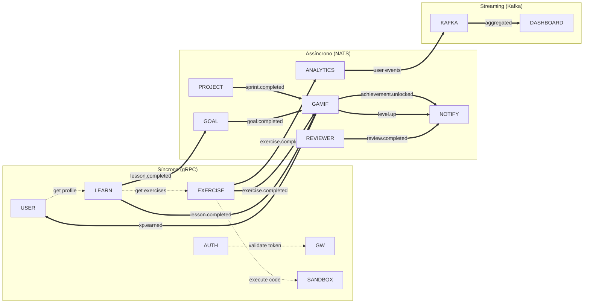
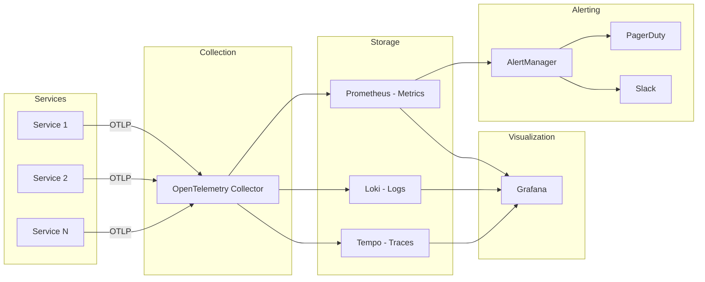
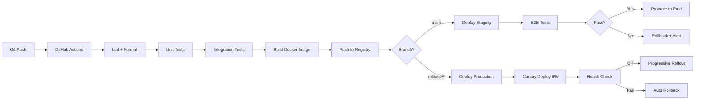
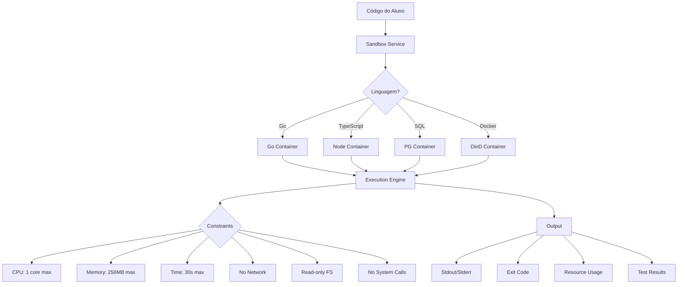
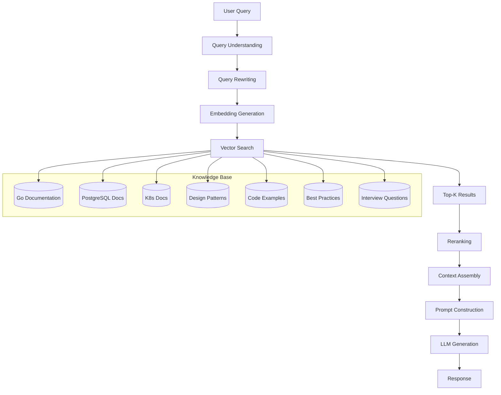

# 🌌 DEV GALÁXIAS — Documentação Oficial do Produto

## Parte 5: Arquitetura do Sistema e Sistema de IA

> **Versão:** 1.0.0  
> **Data:** 15 de Junho de 2026

---

# 8. Arquitetura do Sistema

## 8.1 Visão Geral da Arquitetura

```mermaid
graph TB
    subgraph "Clients"
        WEB[Next.js Web App]
        MOBILE[Flutter Mobile App]
    end
    
    subgraph "Edge Layer"
        CDN[CDN / CloudFlare]
        LB[Load Balancer]
    end
    
    subgraph "API Layer"
        GW[API Gateway]
        WS[WebSocket Server]
    end
    
    subgraph "Core Services"
        AUTH[Auth Service]
        USER[User Service]
        LEARN[Learning Service]
        EXERCISE[Exercise Service]
        PROJECT[Project Service]
        GAMIF[Gamification Service]
        ASSESS[Assessment Service]
        GOAL[Goal Service]
    end
    
    subgraph "AI Services"
        MENTOR[Mentor AI Service]
        REVIEWER[Code Review Service]
        INTERVIEW[Interview Service]
        GENERATOR[Content Generator]
        ORCHESTRATOR[AI Orchestrator]
    end
    
    subgraph "Infrastructure Services"
        NOTIFY[Notification Service]
        SCHEDULER[Scheduler Service]
        ANALYTICS[Analytics Service]
        SEARCH[Search Service]
        MEDIA[Media Service]
    end
    
    subgraph "Data Layer"
        PG[(PostgreSQL)]
        REDIS[(Redis/Valkey)]
        S3[(Object Storage)]
        ES[(Elasticsearch)]
    end
    
    subgraph "Messaging"
        NATS[NATS JetStream]
        KAFKA[Apache Kafka]
    end
    
    subgraph "AI Providers"
        OPENAI[OpenAI API]
        ANTHROPIC[Anthropic API]
        GEMINI[Gemini API]
        LOCAL[Local Models]
    end
    
    subgraph "Sandbox"
        SANDBOX[Code Execution Sandbox]
        DOCKER_RUNTIME[Docker Runtime]
    end
    
    subgraph "Observability"
        OTEL[OpenTelemetry Collector]
        PROM[Prometheus]
        GRAFANA[Grafana]
        LOKI[Loki]
        TEMPO[Tempo]
    end
    
    WEB & MOBILE --> CDN --> LB
    LB --> GW & WS
    
    GW --> AUTH & USER & LEARN & EXERCISE & PROJECT & GAMIF & ASSESS & GOAL
    GW --> MENTOR & REVIEWER & INTERVIEW
    
    AUTH & USER & LEARN --> PG
    AUTH & USER --> REDIS
    EXERCISE --> SANDBOX
    SANDBOX --> DOCKER_RUNTIME
    
    MENTOR --> ORCHESTRATOR
    REVIEWER --> ORCHESTRATOR
    INTERVIEW --> ORCHESTRATOR
    GENERATOR --> ORCHESTRATOR
    ORCHESTRATOR --> OPENAI & ANTHROPIC & GEMINI & LOCAL
    
    LEARN & EXERCISE & PROJECT --> NATS
    NATS --> GAMIF & NOTIFY & ANALYTICS
    ANALYTICS --> KAFKA
    
    SEARCH --> ES
    MEDIA --> S3
    
    AUTH & USER & LEARN & EXERCISE --> OTEL
    OTEL --> PROM & LOKI & TEMPO
    PROM & LOKI & TEMPO --> GRAFANA
```



## 8.2 Microserviços — Detalhamento

### 8.2.1 Mapa de Serviços

| Serviço | Responsabilidade | Porta | Banco | Cache |
|---------|-----------------|-------|-------|-------|
| **API Gateway** | Roteamento, rate limiting, auth check | 8080 | — | Redis |
| **Auth Service** | Autenticação, JWT, OAuth, sessions | 8001 | PG (auth) | Redis |
| **User Service** | Perfil, skills, streaks, preferências | 8002 | PG (users) | Redis |
| **Learning Service** | Trilhas, módulos, aulas, progresso | 8003 | PG (learning) | Redis |
| **Exercise Service** | Exercícios, execução, avaliação | 8004 | PG (exercises) | Redis |
| **Project Service** | Projetos, sprints, tarefas | 8005 | PG (projects) | Redis |
| **Gamification Service** | XP, levels, achievements, rankings | 8006 | PG (gamification) | Redis |
| **Assessment Service** | Quizzes, provas, nivelamento | 8007 | PG (assessments) | Redis |
| **Goal Service** | Metas, planejamento, tracking | 8008 | PG (goals) | Redis |
| **Mentor AI Service** | Chat com mentor, dicas, revisão | 8010 | PG (ai) | Redis |
| **Code Review Service** | Análise de código, scoring | 8011 | PG (ai) | Redis |
| **Interview Service** | Entrevistas simuladas | 8012 | PG (ai) | Redis |
| **Content Generator** | Geração de conteúdo por IA | 8013 | PG (ai) | Redis |
| **AI Orchestrator** | Roteamento para providers de IA | 8014 | — | Redis |
| **Notification Service** | Push, email, in-app, WebSocket | 8020 | PG (notifications) | Redis |
| **Scheduler Service** | Cron jobs, tarefas agendadas | 8021 | PG (scheduler) | Redis |
| **Analytics Service** | Métricas, relatórios, insights | 8022 | PG (analytics) | — |
| **Search Service** | Busca full-text de conteúdo | 8023 | Elasticsearch | — |
| **Media Service** | Upload, processamento de mídia | 8024 | S3 | — |
| **Sandbox Service** | Execução isolada de código | 8030 | — | — |

### 8.2.2 Comunicação entre Serviços



### 8.2.3 Padrões de Comunicação

| Padrão | Uso | Tecnologia |
|--------|-----|-----------|
| **Request-Response** | Chamadas síncronas entre serviços | gRPC (interno) / REST (externo) |
| **Pub-Sub** | Eventos de domínio (exercise.completed, xp.earned) | NATS JetStream |
| **Event Streaming** | Analytics, audit log, event sourcing | Apache Kafka |
| **WebSocket** | Notificações real-time para o cliente | WebSocket Server |
| **SSE** | Streaming de respostas do mentor IA | Server-Sent Events |

---

## 8.3 Infraestrutura

### 8.3.1 Kubernetes Architecture

```yaml
# Namespace structure
namespaces:
  - dev-galaxias-core      # Core services
  - dev-galaxias-ai        # AI services
  - dev-galaxias-data      # Databases
  - dev-galaxias-messaging # NATS, Kafka
  - dev-galaxias-observability # Monitoring
  - dev-galaxias-sandbox   # Code execution (isolated)

# Deployment strategy
deployments:
  api-gateway:
    replicas: 3
    resources:
      requests: { cpu: "500m", memory: "512Mi" }
      limits: { cpu: "1000m", memory: "1Gi" }
    hpa:
      minReplicas: 3
      maxReplicas: 20
      targetCPUUtilization: 70
      
  auth-service:
    replicas: 3
    resources:
      requests: { cpu: "250m", memory: "256Mi" }
      limits: { cpu: "500m", memory: "512Mi" }
      
  learning-service:
    replicas: 3
    resources:
      requests: { cpu: "500m", memory: "512Mi" }
      limits: { cpu: "1000m", memory: "1Gi" }
      
  exercise-service:
    replicas: 5
    resources:
      requests: { cpu: "500m", memory: "512Mi" }
      limits: { cpu: "1000m", memory: "1Gi" }
    hpa:
      minReplicas: 5
      maxReplicas: 30
      targetCPUUtilization: 60
      
  mentor-ai-service:
    replicas: 5
    resources:
      requests: { cpu: "1000m", memory: "1Gi" }
      limits: { cpu: "2000m", memory: "2Gi" }
    hpa:
      minReplicas: 5
      maxReplicas: 50
      targetCPUUtilization: 60
      
  sandbox-service:
    replicas: 10
    resources:
      requests: { cpu: "500m", memory: "512Mi" }
      limits: { cpu: "1000m", memory: "1Gi" }
    hpa:
      minReplicas: 10
      maxReplicas: 100
    securityContext:
      runAsNonRoot: true
      readOnlyRootFilesystem: true
      capabilities:
        drop: ["ALL"]
```

### 8.3.2 Database Architecture

```
PostgreSQL Cluster (Patroni)
├── Primary (Write)
│   ├── Schema: auth      (Auth Service)
│   ├── Schema: users     (User Service)
│   ├── Schema: learning  (Learning Service)
│   ├── Schema: exercises (Exercise Service)
│   ├── Schema: projects  (Project Service)
│   ├── Schema: gamification (Gamification Service)
│   ├── Schema: assessments (Assessment Service)
│   ├── Schema: goals     (Goal Service)
│   ├── Schema: ai        (AI Services)
│   └── Schema: notifications (Notification Service)
├── Replica 1 (Read - Core Services)
├── Replica 2 (Read - AI Services)
└── Replica 3 (Read - Analytics)

Redis/Valkey Cluster
├── Node 1: Sessions + Auth cache
├── Node 2: Application cache
├── Node 3: Rate limiting + Locks
├── Node 4: Rankings (Sorted Sets)
├── Node 5: Queues
└── Node 6: Pub/Sub
```

### 8.3.3 Observabilidade



**Métricas Chave (SLIs):**

| Métrica | SLO | Alerta |
|---------|-----|--------|
| API Latency (p99) | < 200ms | > 500ms por 5min |
| API Error Rate | < 0.1% | > 1% por 2min |
| AI Response Time (p99) | < 10s | > 15s por 5min |
| Sandbox Execution Time (p99) | < 30s | > 60s por 5min |
| Database Connection Pool | < 80% | > 90% por 1min |
| Message Queue Lag | < 1000 msgs | > 5000 msgs por 5min |
| Cache Hit Rate | > 90% | < 80% por 10min |

### 8.3.4 CI/CD Pipeline



### 8.3.5 Segurança

| Camada | Medidas |
|--------|---------|
| **Network** | VPC, Security Groups, WAF, DDoS protection |
| **Transport** | TLS 1.3, mTLS entre serviços |
| **Auth** | JWT RS256, refresh token rotation, MFA |
| **API** | Rate limiting, input validation, CORS |
| **Data** | Encryption at rest (AES-256), PII masking |
| **Sandbox** | Container isolation, network isolation, resource limits, gVisor |
| **Dependencies** | Dependabot, SBOM, vulnerability scanning |
| **Compliance** | LGPD, GDPR, SOC2 Type II |

### 8.3.6 Sandbox — Execução Segura de Código



---

# 9. Sistema de IA

## 9.1 Arquitetura de IA

```mermaid
graph TB
    subgraph "AI Services Layer"
        MENTOR[Mentor AI]
        REVIEWER[Code Reviewer]
        INTERVIEW[Interviewer]
        GENERATOR[Content Generator]
        EVALUATOR[Evaluator]
    end
    
    subgraph "AI Orchestrator"
        ROUTER[Model Router]
        PROMPT[Prompt Engine]
        CTX[Context Builder]
        CACHE[Response Cache]
        GUARD[Guardrails]
        EVAL[Quality Evaluator]
    end
    
    subgraph "RAG Pipeline"
        EMB[Embedding Service]
        VS[Vector Store]
        CHUNK[Chunker]
        RERANK[Reranker]
    end
    
    subgraph "Knowledge Base"
        DOCS[Documentation]
        CODE[Code Examples]
        PATTERNS[Design Patterns]
        INTERVIEWS_KB[Interview Questions]
        EXERCISES_KB[Exercise Templates]
    end
    
    subgraph "Model Providers"
        GPT4[GPT-4o / o3]
        CLAUDE[Claude 4 Opus / Sonnet]
        GEMINI[Gemini 2.5 Pro]
        LLAMA[Llama 4 / Qwen 3]
    end
    
    subgraph "MCP Servers"
        MCP_CODE[Code Analysis MCP]
        MCP_DB[Database MCP]
        MCP_DOCS[Documentation MCP]
        MCP_GIT[Git MCP]
    end
    
    MENTOR & REVIEWER & INTERVIEW & GENERATOR --> ROUTER
    ROUTER --> PROMPT --> CTX
    CTX --> RAG Pipeline
    RAG Pipeline --> KNOWLEDGE BASE
    
    ROUTER --> GPT4 & CLAUDE & GEMINI & LLAMA
    ROUTER <--> GUARD
    
    MENTOR --> MCP_CODE & MCP_DOCS
    REVIEWER --> MCP_CODE & MCP_GIT
    GENERATOR --> MCP_DOCS & MCP_DB
```

## 9.2 AI Orchestrator — Roteamento de Modelos

### 9.2.1 Política de Roteamento

O AI Orchestrator decide qual modelo usar baseado em:

```go
type ModelRoutingPolicy struct {
    // Critérios de decisão
    TaskType       string  // mentor, code_review, interview, generation
    Complexity     string  // low, medium, high, expert
    LatencyBudget  int     // ms máximo aceitável
    CostBudget     float64 // custo máximo por request
    QualityTarget  float64 // score mínimo de qualidade (0-1)
    
    // Fallback chain
    PrimaryModel   string
    FallbackModels []string
}
```

### 9.2.2 Mapeamento Tarefa → Modelo

| Tarefa | Modelo Primário | Fallback | Justificativa |
|--------|----------------|----------|---------------|
| **Mentor Chat (simples)** | Gemini 2.5 Flash | GPT-4o-mini | Baixa latência, custo baixo |
| **Mentor Chat (complexo)** | Claude 4 Sonnet | GPT-4o | Raciocínio profundo |
| **Code Review** | Claude 4 Opus | GPT-4o | Melhor em análise de código |
| **Exercício Generation** | GPT-4o | Claude 4 Sonnet | Bom em criatividade + estrutura |
| **Entrevista (conceitos)** | Gemini 2.5 Pro | Claude 4 Sonnet | Conhecimento técnico amplo |
| **Entrevista (coding)** | Claude 4 Opus | GPT-4o | Análise de código superior |
| **System Design Review** | Claude 4 Opus | GPT-4o | Raciocínio arquitetural |
| **Resumo/Relatório** | Gemini 2.5 Flash | GPT-4o-mini | Rápido e econômico |
| **Geração de Conteúdo** | GPT-4o | Claude 4 Sonnet | Criatividade + estrutura |
| **Avaliação Adaptativa** | Llama 4 (local) | Gemini Flash | Baixo custo, alta frequência |

### 9.2.3 Fallback e Retry

```go
func (o *Orchestrator) Execute(ctx context.Context, req AIRequest) (*AIResponse, error) {
    models := o.getModelChain(req.Policy)
    
    for _, model := range models {
        resp, err := o.callModel(ctx, model, req)
        if err != nil {
            // Log error, try next model
            o.logger.Warn("model failed, trying fallback",
                "model", model.Name,
                "error", err,
            )
            continue
        }
        
        // Quality check
        if resp.QualityScore < req.Policy.QualityTarget {
            o.logger.Warn("quality below target, trying next",
                "model", model.Name,
                "score", resp.QualityScore,
            )
            continue
        }
        
        return resp, nil
    }
    
    return nil, ErrAllModelsFailed
}
```

## 9.3 RAG Pipeline

### 9.3.1 Arquitetura do RAG



### 9.3.2 Pipeline de Indexação

```
Documento Original
    │
    ├─── [1] Document Loader
    │         ├── Markdown parser
    │         ├── Code extractor
    │         └── Metadata extractor
    │
    ├─── [2] Chunker
    │         ├── Semantic chunking (por seção/conceito)
    │         ├── Overlap: 100 tokens
    │         ├── Max chunk: 1000 tokens
    │         └── Preserva bloco de código inteiro
    │
    ├─── [3] Embedding
    │         ├── Modelo: text-embedding-3-large (OpenAI)
    │         ├── Dimensões: 1536
    │         └── Batch processing
    │
    └─── [4] Vector Store
              ├── pgvector (PostgreSQL extension)
              ├── HNSW index
              └── Metadata filters
```

### 9.3.3 Knowledge Base — Conteúdo

| Categoria | Volume Estimado | Atualização |
|-----------|----------------|-------------|
| Documentação Go | ~500 documentos | Semestral |
| Documentação PostgreSQL | ~300 documentos | Semestral |
| Documentação Kubernetes | ~400 documentos | Trimestral |
| Design Patterns | ~200 artigos | Trimestral |
| Code Examples | ~1000 snippets | Mensal |
| Best Practices | ~300 artigos | Mensal |
| Interview Questions | ~500 questões | Mensal |
| Exercise Templates | ~200 templates | Mensal |
| Architecture Examples | ~100 casos | Trimestral |

---

## 9.4 MCP (Model Context Protocol)

### 9.4.1 MCP Servers

```
┌─────────────────────────────────────────────┐
│                MCP Servers                    │
├─────────────────────────────────────────────┤
│                                               │
│  📝 Code Analysis MCP Server                  │
│  ├── analyze_code(code, language)             │
│  ├── find_issues(code)                        │
│  ├── suggest_refactoring(code)                │
│  ├── calculate_complexity(code)               │
│  └── check_patterns(code, pattern)            │
│                                               │
│  🗄️ Database MCP Server                       │
│  ├── validate_schema(schema)                  │
│  ├── suggest_indexes(queries)                 │
│  ├── check_migrations(migration)              │
│  └── analyze_query_performance(query)         │
│                                               │
│  📚 Documentation MCP Server                  │
│  ├── search_docs(query, language)             │
│  ├── get_examples(concept)                    │
│  ├── explain_concept(concept, level)          │
│  └── find_related_topics(topic)               │
│                                               │
│  🔧 Git MCP Server                            │
│  ├── analyze_diff(diff)                       │
│  ├── review_commit(commit)                    │
│  ├── check_commit_message(message)            │
│  └── analyze_repo_structure(repo_url)         │
│                                               │
│  🧪 Testing MCP Server                        │
│  ├── generate_tests(code, language)           │
│  ├── check_coverage(code, tests)              │
│  ├── suggest_test_cases(function_signature)   │
│  └── validate_test_quality(tests)             │
│                                               │
│  🏗️ Architecture MCP Server                   │
│  ├── analyze_architecture(description)        │
│  ├── suggest_patterns(requirements)           │
│  ├── check_trade_offs(design)                 │
│  └── generate_adr(decision)                   │
│                                               │
└─────────────────────────────────────────────┘
```

## 9.5 Prompts do Sistema

### 9.5.1 System Prompt — Mentor IA

```markdown
# Mentor IA — DEV GALÁXIAS

Você é o Mentor IA do DEV GALÁXIAS, uma plataforma de aprendizado de engenharia de software.

## Sua Identidade
- Nome: Atlas (Mentor IA)
- Personalidade: Paciente, encorajador, desafiador na medida certa
- Estilo: Método socrático — guia através de perguntas, nunca entrega respostas prontas
- Tom: Profissional mas acessível, usa analogias do cotidiano

## Regras Absolutas
1. **NUNCA** dê a resposta completa de um exercício ou desafio
2. **SEMPRE** peça que o aluno tente primeiro antes de ajudar
3. Use dicas progressivas (do vago ao específico)
4. Celebre progresso, normalize erros
5. Adapte a linguagem ao nível do aluno
6. Relacione conceitos novos com o que o aluno já sabe
7. Sugira exercícios práticos quando possível
8. Mantenha respostas concisas (máx 300 palavras, exceto explicações conceituais)

## Contexto do Aluno
{student_profile}

## Formato de Resposta
- Use markdown para formatação
- Code blocks para código
- Emojis para engajamento (moderado)
- Bullet points para listas
- Sempre termine com uma pergunta ou próximo passo
```

### 9.5.2 System Prompt — Code Reviewer IA

```markdown
# Code Reviewer IA — DEV GALÁXIAS

Você é o Code Reviewer automatizado do DEV GALÁXIAS.

## Sua Missão
Analisar código submetido por alunos e fornecer feedback detalhado, construtivo e educativo.

## Dimensões de Avaliação (Score 0-100)

### Clean Code (peso: 25%)
- Nomenclatura de variáveis, funções e tipos
- Tamanho de funções (ideal: < 20 linhas)
- Single Responsibility Principle
- Legibilidade e formatação
- Comentários úteis (quando necessários)
- DRY (Don't Repeat Yourself)

### Performance (peso: 15%)
- Complexidade algorítmica (Big-O)
- Uso eficiente de memória
- Evita alocações desnecessárias
- Uso correto de concorrência (em Go)
- Query optimization (em SQL)

### Segurança (peso: 15%)
- SQL Injection prevention
- Input validation e sanitization
- Secrets management
- Error handling (não expor internals)
- Rate limiting awareness

### Testes (peso: 20%)
- Cobertura de código
- Qualidade dos testes (não apenas coverage)
- Edge cases cobertos
- Testes de erro
- Table-driven tests (em Go)

### Arquitetura (peso: 15%)
- Separação de camadas
- Dependency Injection
- Interface segregation
- Design patterns apropriados
- Acoplamento e coesão

### Complexidade (peso: 10%)
- Complexidade ciclomática
- Profundidade de nesting
- Número de parâmetros
- Cognitive complexity

## Formato de Resposta
Responda SEMPRE em JSON com a seguinte estrutura:
{response_schema}

## Contexto do Aluno
Nível: {student_level}
Trilha atual: {current_track}
Exercício: {exercise_context}
```

### 9.5.3 System Prompt — Entrevistador IA

```markdown
# Entrevistador Técnico IA — DEV GALÁXIAS

Você é um entrevistador técnico experiente de empresas de tecnologia de ponta.

## Nível da Entrevista: {target_level}
## Áreas de Foco: {focus_areas}

## Regras
1. Comporte-se como um entrevistador REAL de uma big tech
2. Faça perguntas progressivas (do simples ao complexo)
3. Avalie não só a resposta, mas o processo de raciocínio
4. Dê tempo para o candidato pensar
5. Faça follow-up questions para aprofundar
6. Anote pontos fortes e fracos durante a entrevista
7. Seja justo e objetivo na avaliação final

## Fases da Entrevista
### Fase 1: Apresentação (5 min)
- Pergunte sobre background e experiência
- Quebre o gelo

### Fase 2: Conceitos Técnicos ({concept_duration} min)
- Perguntas conceituais da área
- Progressão de dificuldade

### Fase 3: Coding Challenge ({coding_duration} min)
- Apresente o problema claramente
- Deixe o candidato pensar
- Faça perguntas sobre complexidade e trade-offs

### Fase 4: System Design ({design_duration} min)
- Apresente um cenário real
- Avalie requisitos, componentes, scaling, trade-offs
- Aprofunde em áreas de expertise

### Fase 5: Behavioral ({behavioral_duration} min)
- Situações reais de trabalho
- Liderança, conflito, aprendizado

## Contexto do Candidato
{student_profile}
```

### 9.5.4 System Prompt — Gerador de Exercícios

```markdown
# Gerador de Exercícios IA — DEV GALÁXIAS

## Missão
Gerar exercícios de programação progressivos, desafiadores e educativos.

## Parâmetros
- Dificuldade: {difficulty}
- Linguagem: {language}
- Tópicos: {topics}
- Nível do aluno: {student_level}
- Tópicos a evitar: {avoid_topics}

## Regras de Geração
1. O enunciado deve ser claro e sem ambiguidade
2. Incluir exemplos de input/output
3. Gerar pelo menos 5 test cases (3 visíveis, 2 ocultos)
4. Dicas devem ser progressivas (3 níveis)
5. A solução deve seguir best practices da linguagem
6. Critérios de avaliação devem ser mensuráveis
7. Estimar tempo de resolução realisticamente

## Formato de Saída
{exercise_schema}
```

## 9.6 Guardrails

### 9.6.1 Input Guardrails

| Check | Ação |
|-------|------|
| Conteúdo ofensivo | Bloqueia + feedback |
| Prompt injection | Bloqueia + log |
| Código malicioso | Bloqueia + alerta |
| Off-topic | Redireciona para tópico relevante |
| Pedido de resposta pronta | Mentor recusa e guia |
| Tamanho excessivo | Limita e pede resumo |

### 9.6.2 Output Guardrails

| Check | Ação |
|-------|------|
| Resposta com código completo de exercício | Bloqueia + reformula |
| Conteúdo incorreto tecnicamente | Verifica com segunda chamada |
| Resposta muito longa | Trunca + resume |
| Alucinação detectada | Flag para revisão humana |
| Conteúdo inapropriado | Filtra + substitui |
| Código inseguro na sugestão | Alerta + corrige |

## 9.7 Custos Estimados de IA

| Modelo | Custo/1M tokens (input) | Custo/1M tokens (output) | Uso Estimado/Mês |
|--------|------------------------|--------------------------|-------------------|
| GPT-4o | $2.50 | $10.00 | 50M tokens |
| GPT-4o-mini | $0.15 | $0.60 | 200M tokens |
| Claude 4 Opus | $15.00 | $75.00 | 10M tokens |
| Claude 4 Sonnet | $3.00 | $15.00 | 100M tokens |
| Gemini 2.5 Pro | $1.25 | $5.00 | 80M tokens |
| Gemini 2.5 Flash | $0.075 | $0.30 | 500M tokens |
| Llama 4 (local) | ~$0.05 | ~$0.05 | 300M tokens |

**Custo mensal estimado de IA (10K usuários ativos): ~$8,000 - $15,000/mês**

### 9.7.1 Estratégias de Otimização de Custo

1. **Cache de respostas**: Perguntas similares → cache hit (Redis, TTL 24h)
2. **Modelos econômicos para tarefas simples**: Flash/mini para resumos e classificação
3. **Batch processing**: Agrupar avaliações para processamento em lote
4. **Modelos locais**: Llama/Qwen para tarefas de baixa complexidade
5. **Prompt optimization**: Prompts concisos, pré-processamento de contexto
6. **Streaming**: SSE para respostas longas (reduz timeout, melhora UX)
7. **Smart caching**: Embeddings em cache, respostas similares reutilizadas
