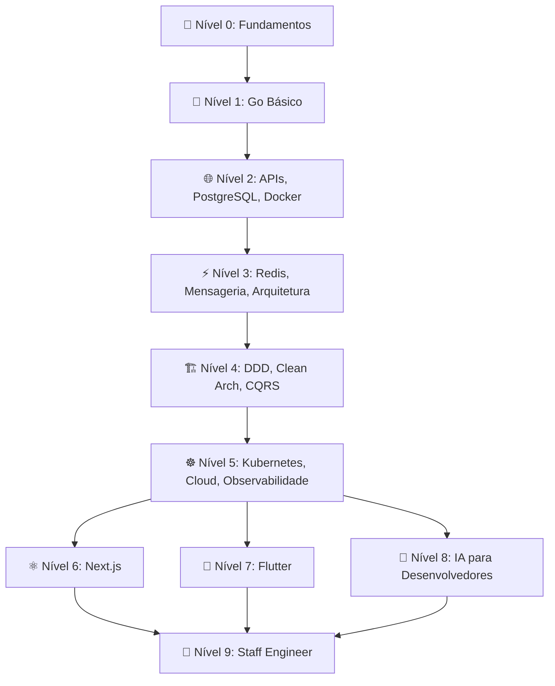

# 🌌 DEV GALÁXIAS — Documentação Oficial do Produto

## Parte 6: Trilhas de Aprendizado Completas

> **Versão:** 1.0.0  
> **Data:** 15 de Junho de 2026

---

# 10. Trilhas de Aprendizado

## Mapa de Trilhas

---

## 📋 Nível 0 — Fundamentos

### Visão Geral

| Atributo | Valor |
|----------|-------|
| **Objetivo** | Construir base sólida em lógica, algoritmos e ferramentas essenciais |
| **Pré-requisitos** | Nenhum |
| **Duração Estimada** | 8-12 semanas (80h) |
| **Dificuldade** | Iniciante |
| **Projeto Final** | CLI Tool para gerenciamento de tarefas |
| **XP Total** | ~2.000 XP |

### Módulos

#### Módulo 0.1 — Lógica de Programação (20h)
| # | Aula | Duração | Exercícios |
|---|------|---------|------------|
| 1 | O que é programação | 15min | 2 quiz |
| 2 | Variáveis e tipos de dados | 20min | 3 fáceis |
| 3 | Operadores aritméticos e lógicos | 20min | 4 fáceis |
| 4 | Condicionais (if/else/switch) | 25min | 3 fáceis + 2 médios |
| 5 | Loops (for, while, do-while) | 25min | 3 fáceis + 2 médios |
| 6 | Funções e escopo | 30min | 3 fáceis + 2 médios |
| 7 | Debugging e troubleshooting | 20min | 2 médios |
| 8 | Pensamento computacional | 20min | 1 médio + 1 difícil |
| **Desafio** | Construir jogo de adivinhação | 60min | 1 projeto mini |

#### Módulo 0.2 — Algoritmos Fundamentais (20h)
| # | Aula | Duração | Exercícios |
|---|------|---------|------------|
| 1 | O que são algoritmos | 15min | 2 quiz |
| 2 | Busca linear e binária | 25min | 3 fáceis + 2 médios |
| 3 | Ordenação: Bubble, Selection, Insertion | 30min | 3 médios |
| 4 | Ordenação: Merge Sort e Quick Sort | 30min | 2 médios + 1 difícil |
| 5 | Recursão | 25min | 3 médios |
| 6 | Complexidade: Big-O notation | 25min | 3 fáceis + 2 médios |
| 7 | Two Pointers e Sliding Window | 30min | 2 médios + 1 difícil |
| 8 | Algoritmos gulosos (Greedy) | 25min | 2 médios |
| **Desafio** | Resolver 5 problemas de algoritmo em 2h | 120min | 5 exercícios |

#### Módulo 0.3 — Estruturas de Dados (20h)
| # | Aula | Duração | Exercícios |
|---|------|---------|------------|
| 1 | Arrays e Slices | 25min | 4 fáceis + 2 médios |
| 2 | Strings e manipulação | 25min | 3 fáceis + 2 médios |
| 3 | Maps/Hash Tables | 25min | 3 médios |
| 4 | Stacks e Queues | 25min | 2 fáceis + 2 médios |
| 5 | Linked Lists | 30min | 2 médios + 1 difícil |
| 6 | Trees e BST | 30min | 2 médios + 1 difícil |
| 7 | Graphs (básico) | 30min | 2 médios |
| 8 | Quando usar qual estrutura | 20min | 2 médios + 1 difícil |
| **Desafio** | Implementar um LRU Cache | 90min | 1 difícil |

#### Módulo 0.4 — Linux Essencial (10h)
| # | Aula | Duração | Exercícios |
|---|------|---------|------------|
| 1 | Introdução ao Linux e Terminal | 20min | 3 fáceis |
| 2 | Navegação: cd, ls, pwd, mkdir | 15min | 4 fáceis |
| 3 | Manipulação: cp, mv, rm, cat, less | 20min | 4 fáceis |
| 4 | Permissões: chmod, chown | 20min | 3 fáceis + 1 médio |
| 5 | Processos: ps, top, kill | 15min | 2 fáceis + 1 médio |
| 6 | Pipes e redirecionamento | 20min | 2 médios |
| 7 | grep, sed, awk | 25min | 3 médios |
| 8 | Shell scripting básico | 30min | 2 médios + 1 difícil |
| **Desafio** | Automatizar setup de projeto com script bash | 60min | 1 médio |

#### Módulo 0.5 — Git e GitHub (10h)
| # | Aula | Duração | Exercícios |
|---|------|---------|------------|
| 1 | O que é controle de versão | 15min | 1 quiz |
| 2 | git init, add, commit | 20min | 3 fáceis |
| 3 | git log, diff, status | 15min | 2 fáceis |
| 4 | Branches: create, switch, merge | 25min | 3 médios |
| 5 | Resolução de conflitos | 25min | 2 médios |
| 6 | Remote: push, pull, fetch | 20min | 2 fáceis + 1 médio |
| 7 | Pull Requests e Code Review | 20min | 1 médio |
| 8 | Git Flow e Conventional Commits | 20min | 1 médio |
| **Desafio** | Contribuir para repo open source (simulado) | 60min | 1 médio |

### Critérios de Aprovação — Nível 0

- [ ] Completar 100% das aulas
- [ ] Score médio em exercícios ≥ 70
- [ ] Completar todos os 5 desafios
- [ ] Projeto final (CLI ToDo) com score ≥ 70
- [ ] Quiz final do nível com score ≥ 75

---

## 🐹 Nível 1 — Go Básico

### Visão Geral

| Atributo | Valor |
|----------|-------|
| **Objetivo** | Dominar os fundamentos da linguagem Go |
| **Pré-requisitos** | Nível 0 completo |
| **Duração Estimada** | 8-10 semanas (60h) |
| **Dificuldade** | Iniciante-Intermediário |
| **Projeto Final** | Calculadora avançada CLI + File Manager CLI |
| **XP Total** | ~3.000 XP |

### Módulos

#### Módulo 1.1 — Go: Primeiros Passos (12h)
| # | Aula | Exercícios |
|---|------|------------|
| 1 | Instalação e Go workspace | 2 fáceis |
| 2 | Hello World e go run/build | 2 fáceis |
| 3 | Variáveis, tipos e constantes | 4 fáceis + 2 médios |
| 4 | Operadores e expressões | 3 fáceis + 2 médios |
| 5 | Control flow: if, switch, for | 4 médios |
| 6 | Funções e múltiplos retornos | 3 médios + 1 difícil |
| 7 | Packages e imports | 2 médios |
| 8 | go fmt, go vet, golangci-lint | 2 fáceis |

#### Módulo 1.2 — Tipos Compostos (12h)
| # | Aula | Exercícios |
|---|------|------------|
| 1 | Arrays e Slices em Go | 4 médios |
| 2 | Maps | 3 médios + 1 difícil |
| 3 | Structs | 3 médios + 1 difícil |
| 4 | Ponteiros | 3 médios + 2 difíceis |
| 5 | Métodos e receivers | 3 médios |
| 6 | Interfaces | 3 médios + 2 difíceis |
| 7 | Type assertions e type switch | 2 médios + 1 difícil |
| 8 | Generics em Go | 2 médios + 1 difícil |

#### Módulo 1.3 — Concorrência (12h)
| # | Aula | Exercícios |
|---|------|------------|
| 1 | Goroutines | 3 médios |
| 2 | Channels (unbuffered) | 3 médios + 1 difícil |
| 3 | Buffered channels | 2 médios + 1 difícil |
| 4 | Select statement | 2 médios + 1 difícil |
| 5 | sync.Mutex e sync.RWMutex | 2 médios + 1 difícil |
| 6 | sync.WaitGroup | 2 médios |
| 7 | Context package | 2 médios + 1 difícil |
| 8 | Patterns: Worker Pool, Fan-out/Fan-in, Pipeline | 3 difíceis |

#### Módulo 1.4 — Error Handling e I/O (12h)
| # | Aula | Exercícios |
|---|------|------------|
| 1 | Error handling idiomático | 3 médios |
| 2 | Custom errors e errors.Is/As | 3 médios + 1 difícil |
| 3 | Panic e recover | 2 médios |
| 4 | File I/O | 3 médios |
| 5 | JSON encoding/decoding | 3 médios + 1 difícil |
| 6 | Bufio e scanner | 2 médios |
| 7 | os/exec e system calls | 2 médios |
| 8 | Flags e CLI arguments | 2 médios + 1 difícil |

#### Módulo 1.5 — Testes em Go (12h)
| # | Aula | Exercícios |
|---|------|------------|
| 1 | Testing package basics | 3 fáceis + 2 médios |
| 2 | Table-driven tests | 3 médios |
| 3 | Subtests e test helpers | 2 médios |
| 4 | Testify e asserções | 2 médios |
| 5 | Mocking com interfaces | 2 médios + 1 difícil |
| 6 | Benchmarks | 2 médios |
| 7 | Test coverage | 2 médios |
| 8 | Integration tests | 2 médios + 1 difícil |

### Critérios de Aprovação — Nível 1

- [ ] 100% das aulas completadas
- [ ] Score médio ≥ 72
- [ ] Projeto: Calculadora CLI com score ≥ 75
- [ ] Projeto: File Manager CLI com score ≥ 75
- [ ] Quiz final ≥ 78
- [ ] Entrevista simulada nível Júnior (conceitos Go) ≥ 70

---

## 🌐 Nível 2 — APIs REST, PostgreSQL e Docker

### Visão Geral

| Atributo | Valor |
|----------|-------|
| **Objetivo** | Construir APIs profissionais com banco de dados e containerização |
| **Pré-requisitos** | Nível 1 completo |
| **Duração Estimada** | 10-12 semanas (80h) |
| **Dificuldade** | Intermediário |
| **Projeto Final** | API REST completa — BookStore / URL Shortener |
| **XP Total** | ~5.000 XP |

### Módulos

#### Módulo 2.1 — HTTP e APIs REST (16h)
- HTTP fundamentals (métodos, headers, status codes)
- net/http package em Go
- Routing com chi ou gorilla/mux
- Middleware (logging, auth, cors, rate limiting)
- Request validation
- Response patterns (JSON, pagination)
- Error handling em APIs
- Versionamento de API
- **Exercícios:** 20 (8 fáceis, 8 médios, 4 difíceis)

#### Módulo 2.2 — PostgreSQL (20h)
- Introdução a bancos relacionais
- SQL: SELECT, INSERT, UPDATE, DELETE
- JOINs (INNER, LEFT, RIGHT, FULL)
- Indexes e query optimization
- Transactions e ACID
- Migrations com golang-migrate
- pgx driver em Go
- Query builder vs Raw SQL
- Views, CTEs, Window Functions
- Backup e recovery
- **Exercícios:** 25 (8 fáceis, 10 médios, 5 difíceis, 2 especialistas)

#### Módulo 2.3 — Autenticação e Segurança (12h)
- Hashing de senhas (bcrypt)
- JWT (access + refresh tokens)
- OAuth 2.0 / OIDC
- RBAC (Role-Based Access Control)
- CORS e CSRF
- Rate limiting
- Input sanitization
- Helmet headers
- **Exercícios:** 15 (4 fáceis, 7 médios, 4 difíceis)

#### Módulo 2.4 — Docker (16h)
- O que é containerização
- Dockerfile (multi-stage builds)
- Docker CLI (build, run, exec, logs)
- Docker Compose
- Volumes e networking
- Environment variables e secrets
- Healthchecks
- Docker para desenvolvimento local
- Container best practices e segurança
- **Exercícios:** 15 (5 fáceis, 6 médios, 4 difíceis)

#### Módulo 2.5 — Projeto Integrador (16h)
- Planejamento e arquitetura do projeto
- Setup do repositório e CI
- Implementação feature por feature
- Testes automatizados
- Documentação (Swagger/OpenAPI)
- Deploy com Docker Compose
- Code review final
- **Projeto: API REST — BookStore ou URL Shortener**

### Critérios de Aprovação — Nível 2

- [ ] 100% das aulas completadas
- [ ] Score médio ≥ 74
- [ ] Projeto final com deploy funcionando
- [ ] Code review do projeto ≥ 75
- [ ] Cobertura de testes ≥ 75%
- [ ] Documentação Swagger completa
- [ ] Entrevista simulada Júnior+ ≥ 72

---

## ⚡ Nível 3 — Redis, Mensageria e Arquitetura

### Visão Geral

| Atributo | Valor |
|----------|-------|
| **Objetivo** | Dominar caching, mensageria e fundamentos de arquitetura |
| **Pré-requisitos** | Nível 2 completo |
| **Duração Estimada** | 8-10 semanas (60h) |
| **Dificuldade** | Intermediário-Avançado |
| **Projeto Final** | Chat Real-time com WebSocket + NATS |
| **XP Total** | ~5.000 XP |

### Módulos

#### Módulo 3.1 — Redis/Valkey (15h)
- Data types: String, List, Set, Sorted Set, Hash, Stream
- Patterns: Cache-aside, Write-through, Write-behind
- TTL e eviction policies
- Pub/Sub
- Redis Transactions
- Distributed locks (Redlock)
- Rate limiting com Redis
- Session management
- Leaderboards com Sorted Sets
- **Exercícios:** 18 (5 fáceis, 8 médios, 4 difíceis, 1 especialista)

#### Módulo 3.2 — Mensageria com NATS (15h)
- Pub/Sub fundamentals
- NATS Core: publish, subscribe, request-reply
- NATS JetStream: persistência de mensagens
- Consumer groups e load balancing
- Dead letter queues
- Retry policies
- Event-driven patterns
- NATS em Go (nats.go)
- **Exercícios:** 15 (4 fáceis, 7 médios, 3 difíceis, 1 especialista)

#### Módulo 3.3 — Apache Kafka (15h)
- Kafka vs NATS: quando usar cada um
- Topics, partitions, consumer groups
- Producers e consumers em Go
- Kafka Connect
- Schema Registry
- Exactly-once semantics
- Event Sourcing com Kafka
- **Exercícios:** 12 (3 fáceis, 5 médios, 3 difíceis, 1 especialista)

#### Módulo 3.4 — Fundamentos de Arquitetura (15h)
- Monolito vs Microserviços
- API Gateway pattern
- Service discovery
- Circuit breaker
- Retry e backoff
- Idempotência
- CAP theorem
- Event-driven architecture
- Saga pattern (introdução)
- **Exercícios:** 12 (2 fáceis, 6 médios, 3 difíceis, 1 especialista)

### Critérios de Aprovação — Nível 3

- [ ] 100% das aulas
- [ ] Score médio ≥ 75
- [ ] Projeto: Chat Real-time com score ≥ 76
- [ ] Quiz de arquitetura ≥ 78
- [ ] Entrevista simulada Pleno ≥ 68

---

## 🏗️ Nível 4 — DDD, Clean Architecture, CQRS, Event Driven

### Visão Geral

| Atributo | Valor |
|----------|-------|
| **Objetivo** | Dominar arquitetura de software avançada |
| **Pré-requisitos** | Nível 3 completo |
| **Duração Estimada** | 10-14 semanas (80h) |
| **Dificuldade** | Avançado |
| **Projeto Final** | CRM System com DDD + CQRS |
| **XP Total** | ~8.000 XP |

### Módulos

#### Módulo 4.1 — Domain-Driven Design (20h)
- Linguagem Ubíqua
- Bounded Contexts
- Entities, Value Objects, Aggregates
- Domain Events
- Repositories
- Domain Services vs Application Services
- Anti-corruption Layer
- Strategic vs Tactical DDD
- Context Mapping
- **Exercícios:** 15 (3 fáceis, 6 médios, 4 difíceis, 2 especialistas)

#### Módulo 4.2 — Clean Architecture (20h)
- Princípios SOLID em profundidade
- Clean Architecture layers
- Dependency Rule
- Use Cases / Interactors
- Gateways e Adapters
- Presenters
- Clean Architecture em Go
- Hexagonal Architecture (Ports & Adapters)
- Comparação de abordagens
- **Exercícios:** 15 (2 fáceis, 6 médios, 5 difíceis, 2 especialistas)

#### Módulo 4.3 — CQRS e Event Sourcing (20h)
- CQRS: Command Query Responsibility Segregation
- Separação de modelos de leitura e escrita
- Event Sourcing fundamentals
- Event Store
- Projeções e Read Models
- Snapshots
- Eventual consistency
- Sagas e Process Managers
- CQRS + Event Sourcing em Go
- **Exercícios:** 12 (2 fáceis, 4 médios, 4 difíceis, 2 especialistas)

#### Módulo 4.4 — Event-Driven Architecture (20h)
- Event types: Domain, Integration, Notification
- Choreography vs Orchestration
- Transactional Outbox Pattern
- Change Data Capture (CDC)
- Event schema evolution
- Idempotent consumers
- Dead letter handling
- Testing event-driven systems
- **Exercícios:** 12 (2 fáceis, 4 médios, 4 difíceis, 2 especialistas)

### Critérios de Aprovação — Nível 4

- [ ] 100% das aulas
- [ ] Score médio ≥ 76
- [ ] Projeto CRM com DDD + CQRS: score ≥ 78
- [ ] Architecture review do projeto ≥ 80
- [ ] ADR (Architecture Decision Record) escrito
- [ ] Entrevista simulada Pleno ≥ 72

---

## ☸️ Nível 5 — Kubernetes, Cloud e Observabilidade

### Visão Geral

| Atributo | Valor |
|----------|-------|
| **Objetivo** | Dominar deploy, cloud e operações de sistemas distribuídos |
| **Pré-requisitos** | Nível 4 completo |
| **Duração Estimada** | 10-12 semanas (80h) |
| **Dificuldade** | Avançado |
| **Projeto Final** | Deploy do ERP Modular em K8s com observabilidade completa |
| **XP Total** | ~10.000 XP |

### Módulos

#### Módulo 5.1 — Kubernetes (25h)
- K8s architecture: nodes, pods, services
- kubectl essentials
- Deployments, ReplicaSets, StatefulSets
- Services: ClusterIP, NodePort, LoadBalancer
- Ingress e Ingress Controllers
- ConfigMaps e Secrets
- PersistentVolumes e PVCs
- Horizontal Pod Autoscaler
- RBAC em Kubernetes
- Helm Charts
- Kustomize
- Operators (introdução)
- **Exercícios:** 20 (5 fáceis, 8 médios, 5 difíceis, 2 especialistas)

#### Módulo 5.2 — Cloud (20h)
- Cloud fundamentals (IaaS, PaaS, SaaS)
- AWS/GCP/Azure essentials
- Networking: VPC, Subnets, Security Groups
- Load Balancing
- Object Storage (S3)
- Managed Databases (RDS)
- IAM e security
- Terraform (Infrastructure as Code)
- CI/CD pipelines (GitHub Actions)
- Cost optimization
- **Exercícios:** 15 (4 fáceis, 6 médios, 4 difíceis, 1 especialista)

#### Módulo 5.3 — Observabilidade (20h)
- Pilares: Metrics, Logs, Traces
- OpenTelemetry SDK em Go
- Prometheus + Grafana
- Structured logging (slog em Go)
- Distributed tracing (Tempo/Jaeger)
- Log aggregation (Loki)
- SLIs, SLOs, SLAs
- Alerting rules
- Dashboards operacionais
- On-call e incident management
- **Exercícios:** 15 (3 fáceis, 6 médios, 4 difíceis, 2 especialistas)

#### Módulo 5.4 — Projeto ERP (15h)
- Design do ERP modular
- Deploy em Kubernetes
- Configuração de observabilidade completa
- Load testing com k6
- Chaos engineering básico
- Runbooks operacionais
- **Projeto: ERP Modular em K8s**

### Critérios de Aprovação — Nível 5

- [ ] 100% das aulas
- [ ] Score médio ≥ 78
- [ ] ERP deployado e funcionando em K8s
- [ ] Dashboard Grafana operacional
- [ ] Alertas configurados e funcionando
- [ ] Load test passando (1000 req/s)
- [ ] Entrevista simulada Sênior ≥ 70

---

## ⚛️ Nível 6 — Next.js

### Visão Geral

| Atributo | Valor |
|----------|-------|
| **Objetivo** | Construir aplicações web modernas com Next.js |
| **Pré-requisitos** | Nível 2 completo (mínimo) |
| **Duração Estimada** | 8-10 semanas (60h) |
| **Dificuldade** | Intermediário |
| **Projeto Final** | Dashboard Web para o CRM (Next.js + API Go) |
| **XP Total** | ~5.000 XP |

### Módulos

#### Módulo 6.1 — TypeScript e React Fundamentals (15h)
- TypeScript essentials para devs Go
- React components, props, state
- Hooks: useState, useEffect, useContext, useMemo
- Custom hooks
- React patterns

#### Módulo 6.2 — Next.js Core (15h)
- App Router e File-based routing
- Server Components vs Client Components
- Data fetching (Server Actions, API Routes)
- Layouts, loading, error boundaries
- Middleware
- Image optimization
- SEO e metadata

#### Módulo 6.3 — Styling e UI (10h)
- CSS Modules
- Tailwind CSS
- Component libraries (shadcn/ui)
- Responsividade
- Animações (Framer Motion)
- Dark mode

#### Módulo 6.4 — Estado e Integração (10h)
- State management (Zustand/Jotai)
- Form handling (React Hook Form + Zod)
- API integration com SWR/React Query
- Authentication (NextAuth)
- Real-time com WebSocket

#### Módulo 6.5 — Deploy e Performance (10h)
- Vercel deploy
- Docker deploy
- Performance optimization
- Bundle analysis
- Core Web Vitals
- Testing (Vitest + Playwright)

### Critérios de Aprovação — Nível 6

- [ ] 100% das aulas
- [ ] Score médio ≥ 74
- [ ] Dashboard CRM funcionando e deployado
- [ ] Responsive (mobile + desktop)
- [ ] Core Web Vitals ≥ 90

---

## 📱 Nível 7 — Flutter

### Visão Geral

| Atributo | Valor |
|----------|-------|
| **Objetivo** | Construir apps móveis multiplataforma com Flutter |
| **Pré-requisitos** | Nível 2 completo (mínimo) |
| **Duração Estimada** | 10-12 semanas (70h) |
| **Dificuldade** | Intermediário |
| **Projeto Final** | App Mobile do CRM (Flutter + API Go) |
| **XP Total** | ~5.000 XP |

### Módulos

#### Módulo 7.1 — Dart Fundamentals (12h)
- Dart syntax para devs Go
- Types, null safety, collections
- Async/await, Futures, Streams
- Classes, mixins, extensions

#### Módulo 7.2 — Flutter Core (18h)
- Widget tree e composição
- Stateless vs Stateful widgets
- Layout: Row, Column, Stack, Flex
- Navigation e routing (go_router)
- Forms e validação
- Temas e styling

#### Módulo 7.3 — State Management (12h)
- setState, InheritedWidget
- Riverpod (recomendado)
- BLoC pattern
- State management comparison

#### Módulo 7.4 — Features Nativas (14h)
- Camera e galeria
- Geolocalização
- Push notifications (FCM)
- Local storage (Hive/SharedPreferences)
- Biometrics
- Deep links

#### Módulo 7.5 — API e Deploy (14h)
- HTTP client (Dio)
- Autenticação e token management
- Offline-first strategies
- CI/CD (Codemagic/Fastlane)
- App Store / Play Store deploy
- Testing (unit, widget, integration)

### Critérios de Aprovação — Nível 7

- [ ] 100% das aulas
- [ ] Score médio ≥ 74
- [ ] App CRM funcionando em iOS e Android
- [ ] CI/CD pipeline configurado
- [ ] Testes com coverage ≥ 70%

---

## 🤖 Nível 8 — IA para Desenvolvedores

### Visão Geral

| Atributo | Valor |
|----------|-------|
| **Objetivo** | Dominar IA aplicada a desenvolvimento de software |
| **Pré-requisitos** | Nível 5 completo |
| **Duração Estimada** | 12-16 semanas (100h) |
| **Dificuldade** | Avançado |
| **Projeto Final** | Sistema de IA com RAG + Agentes |
| **XP Total** | ~12.000 XP |

### Módulos

#### Módulo 8.1 — Fundamentos de IA/ML (20h)
- O que é Machine Learning
- Tipos: Supervised, Unsupervised, Reinforcement
- Neural Networks basics
- Transformers e Attention
- LLMs: como funcionam
- Tokens, embeddings, context window
- Fine-tuning vs Prompt Engineering
- Benchmarks e avaliação

#### Módulo 8.2 — APIs de LLM (15h)
- OpenAI API (Chat, Completions, Embeddings)
- Anthropic API (Messages, Tool Use)
- Google Gemini API
- Modelos open source (Ollama, vLLM)
- Streaming responses
- Function calling / Tool use
- Structured output (JSON mode)
- Cost optimization

#### Módulo 8.3 — Prompt Engineering Avançado (15h)
- Zero-shot, Few-shot, Chain-of-Thought
- System prompts eficazes
- Prompt templates
- Prompt chaining
- Self-consistency
- Constitutional AI
- Prompt injection defense
- Evaluation frameworks

#### Módulo 8.4 — RAG (Retrieval Augmented Generation) (20h)
- RAG architecture
- Document processing e chunking
- Embedding models
- Vector databases (pgvector, Qdrant, Pinecone)
- Retrieval strategies
- Reranking
- Hybrid search (semantic + keyword)
- RAG evaluation (RAGAS)
- Agentic RAG
- Production RAG pipelines em Go

#### Módulo 8.5 — MCP (Model Context Protocol) (10h)
- O que é MCP
- MCP Servers e Clients
- Tools, Resources, Prompts
- Implementando MCP servers em Go
- Integração com LLMs
- Segurança e sandboxing

#### Módulo 8.6 — Agentes de IA (20h)
- O que são agentes de IA
- ReAct pattern
- Multi-agent systems
- Agent orchestration
- Memory systems (short-term, long-term)
- Planning e reasoning
- Tool use avançado
- Guardrails e safety
- Agent evaluation
- Construindo agentes em Go

### Critérios de Aprovação — Nível 8

- [ ] 100% das aulas
- [ ] Score médio ≥ 78
- [ ] Projeto: Sistema RAG funcionando
- [ ] Projeto: Agente com tool use
- [ ] MCP server implementado
- [ ] Entrevista simulada Sênior (IA focus) ≥ 72

---

## 👑 Nível 9 — Staff Engineer

### Visão Geral

| Atributo | Valor |
|----------|-------|
| **Objetivo** | Desenvolver competências de Staff/Principal Engineer |
| **Pré-requisitos** | Nível 5 + pelo menos 2 de (Nível 6, 7, 8) |
| **Duração Estimada** | 16-24 semanas (120h) |
| **Dificuldade** | Expert |
| **Projeto Final** | Plataforma SaaS Multi-Tenant OU Plataforma de IA Multiagente |
| **XP Total** | ~20.000 XP |

### Módulos

#### Módulo 9.1 — Liderança Técnica (20h)
- O papel do Staff Engineer
- Tipos: Tech Lead, Architect, Solver, Right Hand
- Influência sem autoridade
- Writing: RFCs, Design Documents, ADRs
- Tech strategy e roadmaps
- Mentoria e coaching de engenheiros
- Code review como ferramenta de ensino
- Comunicação com stakeholders não-técnicos

#### Módulo 9.2 — System Design Avançado (25h)
- Designing for scale (millions of users)
- Multi-region deployment
- Data partitioning e sharding
- Distributed consensus (Raft, Paxos)
- Global load balancing
- CDN architecture
- Real-time systems at scale
- ML infrastructure design
- Database selection framework
- Case studies: Netflix, Uber, Discord

#### Módulo 9.3 — Reliability Engineering (20h)
- SRE principles
- Error budgets
- Chaos engineering
- Disaster recovery planning
- Multi-region failover
- Capacity planning
- Performance engineering
- Cost optimization at scale
- Post-mortem culture
- Runbooks e playbooks

#### Módulo 9.4 — Platform Engineering (20h)
- Internal Developer Platform (IDP)
- Developer Experience (DX)
- Service mesh (Istio/Linkerd)
- API management
- Feature flags
- A/B testing infrastructure
- Multi-tenancy patterns
- Compliance e governance
- Build systems e monorepos

#### Módulo 9.5 — Strategic Thinking (15h)
- Technical vision e strategy
- Build vs buy decisions
- Technology radar
- Migration strategies (strangler fig, etc.)
- Legacy modernization
- Team topology design
- Cross-functional collaboration
- Industry trends e innovation

#### Módulo 9.6 — Projeto Final (20h)
- Opção A: Plataforma SaaS Multi-Tenant (14 sprints)
- Opção B: Plataforma de IA Multiagente (16 sprints)
- Design Document completo
- Implementação com todos os padrões
- Deploy multi-ambiente
- Observabilidade completa
- Load testing e chaos testing
- Documentação operacional

### Critérios de Aprovação — Nível 9

- [ ] 100% das aulas
- [ ] Score médio ≥ 82
- [ ] Projeto final com score ≥ 85
- [ ] RFC/Design Document aprovado
- [ ] Architecture review ≥ 85
- [ ] Entrevista simulada Staff ≥ 75
- [ ] Portfolio com ≥ 10 projetos
- [ ] Mentoria de pelo menos 1 aluno iniciante
