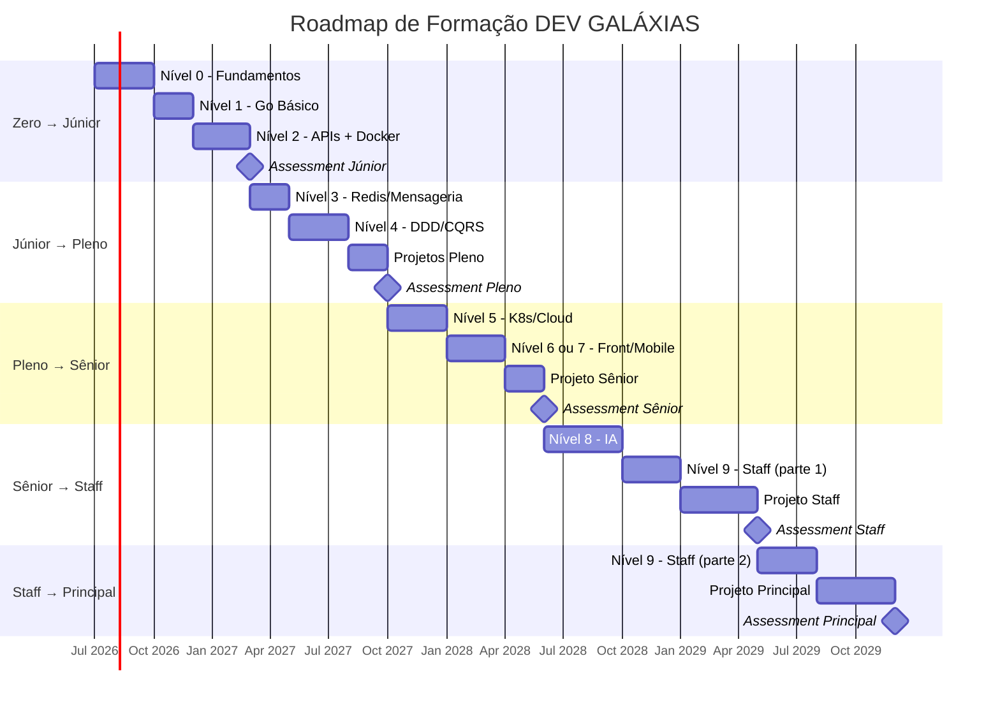
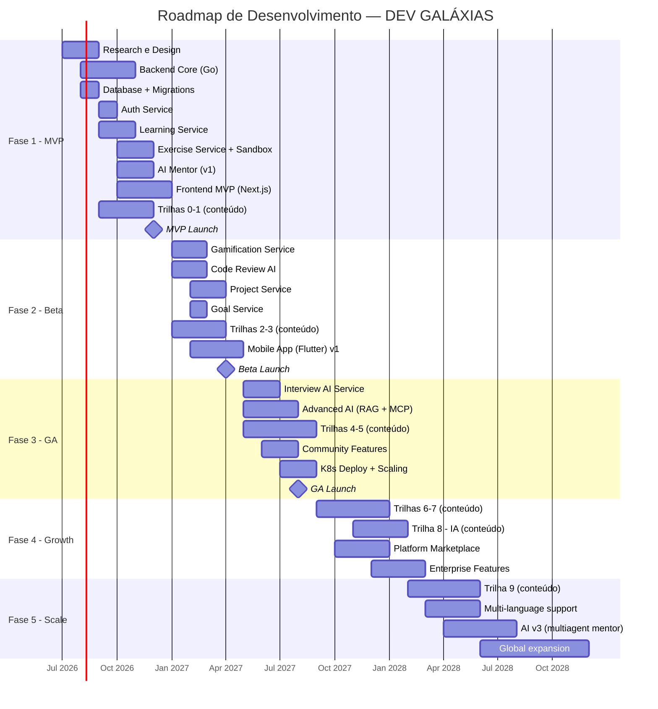

# 🌌 DEV GALÁXIAS — Documentação Oficial do Produto

## Parte 7: Roadmap Completo

> **Versão:** 1.0.0  
> **Data:** 15 de Junho de 2026

---

# 11. Roadmap de Carreira — Formação Completa

## 11.1 Visão Geral das Fases



---

## 11.2 Fase 1: Zero → Júnior

### Estimativas

| Métrica | Valor |
|---------|-------|
| **Duração** | 6-12 meses |
| **Horas totais** | 400-600h |
| **Horas/dia recomendadas** | 2-3h |
| **Trilhas** | Nível 0 + Nível 1 + Nível 2 |
| **Projetos mínimos** | 4 |
| **XP estimado** | ~10.000 |

### Competências Adquiridas

```
Técnicas:
├── Lógica de programação sólida
├── Algoritmos e estruturas de dados fundamentais
├── Go: tipos, funções, structs, interfaces, goroutines
├── APIs REST com Go (net/http ou chi)
├── PostgreSQL: queries, joins, indexes, transactions
├── Docker: Dockerfile, docker-compose
├── Git: branching, merging, PRs
├── Linux: terminal, scripts básicos
├── Testes unitários e de integração
└── Autenticação JWT

Soft Skills:
├── Resolução de problemas
├── Debugging sistemático
├── Leitura de documentação
├── Comunicação técnica básica
└── Trabalho com controle de versão
```

### Projetos Obrigatórios

| # | Projeto | Duração | Skills Validadas |
|---|---------|---------|-----------------|
| 1 | Calculadora CLI | 1 semana | Go basics, I/O, error handling |
| 2 | ToDo CLI | 2 semanas | Go, JSON, file I/O, structs |
| 3 | API REST BookStore | 3 semanas | HTTP, PostgreSQL, Docker, JWT |
| 4 | URL Shortener | 2 semanas | Go, Redis, PostgreSQL, Docker |

### Critérios de Promoção para Júnior

- [x] Trilhas 0, 1 e 2 completas com score ≥ 70
- [x] Todos os 4 projetos entregues com score ≥ 70
- [x] Entrevista simulada Júnior com score ≥ 70
- [x] Code review médio ≥ 68
- [x] Portfolio com projetos no GitHub

---

## 11.3 Fase 2: Júnior → Pleno

### Estimativas

| Métrica | Valor |
|---------|-------|
| **Duração** | 12-18 meses |
| **Horas totais** | 500-700h |
| **Horas/dia recomendadas** | 2-3h |
| **Trilhas** | Nível 3 + Nível 4 |
| **Projetos mínimos** | 3 |
| **XP estimado** | ~13.000 (acumulado ~23.000) |

### Competências Adquiridas

```
Técnicas:
├── Redis: caching, pub/sub, distributed locks
├── NATS/Kafka: mensageria e event-driven
├── DDD: entities, value objects, aggregates, bounded contexts
├── Clean Architecture em Go
├── CQRS e Event Sourcing
├── Patterns: Circuit Breaker, Retry, Saga
├── API design avançado
├── Testes de integração e e2e
├── CI/CD pipelines
└── Documentação técnica (ADRs)

Soft Skills:
├── Pensamento arquitetural
├── Análise de trade-offs
├── Code review construtivo
├── Estimativa de esforço
└── Comunicação técnica intermediária
```

### Projetos Obrigatórios

| # | Projeto | Duração | Skills Validadas |
|---|---------|---------|-----------------|
| 5 | Chat Real-time | 4 semanas | WebSocket, NATS, Redis, Go |
| 6 | CRM System | 6 semanas | DDD, Clean Arch, CQRS, PostgreSQL |
| 7 | Microservice Template | 2 semanas | Patterns, CI/CD, observabilidade |

### Critérios de Promoção para Pleno

- [x] Trilhas 3 e 4 completas com score ≥ 74
- [x] CRM com DDD + CQRS: score ≥ 76
- [x] Architecture review do CRM ≥ 78
- [x] ADR escrito e aprovado
- [x] Entrevista simulada Pleno ≥ 72
- [x] Code review médio ≥ 74
- [x] Capacidade de discutir trade-offs arquiteturais

---

## 11.4 Fase 3: Pleno → Sênior

### Estimativas

| Métrica | Valor |
|---------|-------|
| **Duração** | 18-24 meses |
| **Horas totais** | 600-900h |
| **Horas/dia recomendadas** | 2h |
| **Trilhas** | Nível 5 + Nível 6 ou 7 |
| **Projetos mínimos** | 3 |
| **XP estimado** | ~15.000 (acumulado ~38.000) |

### Competências Adquiridas

```
Técnicas:
├── Kubernetes: deploy, scaling, monitoring
├── Cloud: AWS/GCP essentials, Terraform
├── Observabilidade: OpenTelemetry, Prometheus, Grafana
├── SLIs/SLOs/SLAs
├── Performance engineering e load testing
├── Next.js ou Flutter (full-stack capability)
├── System design intermediário
├── Chaos engineering básico
├── Multi-service deployment
└── Incident management

Soft Skills:
├── Mentoria de desenvolvedores juniores
├── Liderança técnica de features
├── Apresentações técnicas
├── Negociação de escopo técnico
└── Planejamento de sprints técnicos
```

### Projetos Obrigatórios

| # | Projeto | Duração | Skills Validadas |
|---|---------|---------|-----------------|
| 8 | ERP Modular | 10 semanas | Microservices, CQRS, K8s, observabilidade |
| 9 | Dashboard Web (Next.js) | 6 semanas | Next.js, API integration, responsive |
| 10 | App Mobile (Flutter) | 6 semanas | Flutter, state management, native features |

### Critérios de Promoção para Sênior

- [x] Trilha 5 completa com score ≥ 78
- [x] Trilha 6 ou 7 completa com score ≥ 74
- [x] ERP deployado em K8s com observabilidade
- [x] Load test passando (1000+ req/s)
- [x] Entrevista simulada Sênior ≥ 72
- [x] Code review médio ≥ 78
- [x] System design review ≥ 75
- [x] Experiência mentorando pelo menos 1 aluno

---

## 11.5 Fase 4: Sênior → Staff

### Estimativas

| Métrica | Valor |
|---------|-------|
| **Duração** | 24-36 meses |
| **Horas totais** | 800-1200h |
| **Horas/dia recomendadas** | 1.5-2h |
| **Trilhas** | Nível 8 + Nível 9 (parcial) |
| **Projetos mínimos** | 2 |
| **XP estimado** | ~32.000 (acumulado ~70.000) |

### Competências Adquiridas

```
Técnicas:
├── IA: LLMs, RAG, MCP, Agentes
├── System design avançado (multi-região, alta escala)
├── Platform engineering
├── Multi-tenancy patterns
├── Reliability engineering (SRE)
├── Performance optimization at scale
├── Data architecture
├── Security architecture
├── API platform design
└── Technical writing (RFCs, Design Docs)

Soft Skills:
├── Visão estratégica técnica
├── Influência cross-team
├── Mentoria de seniores
├── Decisões de build vs buy
├── Comunicação executiva
├── Facilitação de design reviews
└── Gestão de dívida técnica
```

### Projetos Obrigatórios

| # | Projeto | Duração | Skills Validadas |
|---|---------|---------|-----------------|
| 11 | Sistema RAG + Agentes | 8 semanas | LLMs, RAG, MCP, tool use, Go |
| 12 | Plataforma SaaS Multi-Tenant | 14 semanas | Tudo (multi-tenancy, billing, compliance, scale) |

### Critérios de Promoção para Staff

- [x] Trilha 8 completa com score ≥ 78
- [x] Trilha 9 (módulos 1-4) com score ≥ 80
- [x] SaaS Multi-Tenant: score ≥ 82
- [x] RFC/Design Document escrito e aprovado
- [x] Architecture review ≥ 85
- [x] Entrevista simulada Staff ≥ 75
- [x] Code review médio ≥ 82
- [x] Portfolio com ≥ 10 projetos
- [x] Pelo menos 3 mentees ativos

---

## 11.6 Fase 5: Staff → Principal

### Estimativas

| Métrica | Valor |
|---------|-------|
| **Duração** | 24-48 meses |
| **Horas totais** | 500-800h (foco em profundidade) |
| **Horas/dia recomendadas** | 1-2h |
| **Trilhas** | Nível 9 (completo) |
| **Projetos mínimos** | 1 |
| **XP estimado** | ~30.000 (acumulado ~100.000) |

### Competências Adquiridas

```
Técnicas:
├── Novel system design (sistemas nunca antes construídos)
├── Research e inovação técnica
├── Multi-organizational impact
├── Industry-shaping decisions
├── Deep expertise em múltiplos domínios
├── Technology evaluation framework
├── Migration strategies at scale
├── Compliance e governance architecture
└── AI/ML platform architecture

Liderança:
├── Visão técnica de 3-5 anos
├── Influência na indústria (talks, papers, open source)
├── Mentoria de Staff Engineers
├── Team topology design
├── Cultura de engenharia
├── Innovation frameworks
└── Executive communication
```

### Projetos Obrigatórios

| # | Projeto | Duração | Skills Validadas |
|---|---------|---------|-----------------|
| 13 | Plataforma de IA Multiagente | 16 semanas | Orquestração de agentes, RAG avançado, escala, inovação |

### Critérios de Promoção para Principal

- [x] Trilha 9 completa com score ≥ 85
- [x] Plataforma de IA: score ≥ 88
- [x] Tech Report/Paper escrito
- [x] Design Document com scope organizacional
- [x] Entrevista simulada Principal ≥ 78
- [x] Demonstrou inovação técnica
- [x] Portfolio com ≥ 13 projetos
- [x] Impacto mensurável como mentor

---

## 11.7 Resumo Consolidado do Roadmap de Carreira

| Fase | Duração | Horas | Trilhas | Projetos | XP |
|------|---------|-------|---------|----------|-----|
| **Zero → Júnior** | 6-12 meses | 400-600h | 0, 1, 2 | 4 | 10K |
| **Júnior → Pleno** | 12-18 meses | 500-700h | 3, 4 | 3 | 13K |
| **Pleno → Sênior** | 18-24 meses | 600-900h | 5, 6/7 | 3 | 15K |
| **Sênior → Staff** | 24-36 meses | 800-1200h | 8, 9 (parcial) | 2 | 32K |
| **Staff → Principal** | 24-48 meses | 500-800h | 9 (completo) | 1 | 30K |
| **TOTAL** | **7-12 anos** | **2800-4200h** | **10 trilhas** | **13 projetos** | **100K XP** |

---

# 12. Roadmap de Desenvolvimento do Produto

## 12.1 Visão Temporal



---

## 12.2 Fase 1 — MVP (Jul-Dez 2026)

### Scope do MVP

**Incluído:**
- ✅ Auth (email + Google OAuth)
- ✅ Perfil de usuário com assessment inicial
- ✅ Trilhas 0 e 1 (Fundamentos + Go Básico)
- ✅ Sistema de aulas (texto interativo)
- ✅ Exercícios com sandbox (Go)
- ✅ Mentor IA (chat básico)
- ✅ XP e levels básicos
- ✅ Streak tracking
- ✅ Dashboard básico
- ✅ Web app (Next.js)

**Não incluído no MVP:**
- ❌ Mobile app
- ❌ Code review IA avançado
- ❌ Entrevistador IA
- ❌ Sistema de projetos
- ❌ Gamificação completa (rankings, achievements)
- ❌ Metas automáticas
- ❌ Comunidade
- ❌ Trilhas 2+

### Time Estimado para MVP

| Papel | Quantidade | Dedicação |
|-------|-----------|-----------|
| Backend Engineer (Go) | 3 | Full-time |
| Frontend Engineer (Next.js) | 2 | Full-time |
| AI/ML Engineer | 2 | Full-time |
| DevOps/SRE | 1 | Full-time |
| Designer (UX/UI) | 1 | Full-time |
| Product Manager | 1 | Full-time |
| Content Creator (Tech) | 2 | Full-time |
| QA Engineer | 1 | Full-time |
| **Total** | **13** | — |

### KPIs do MVP

| Métrica | Meta |
|---------|------|
| Usuários cadastrados | 500 |
| DAU | 100 |
| Aulas completadas/dia | 200 |
| Exercícios resolvidos/dia | 300 |
| Interações com Mentor IA/dia | 150 |
| NPS | ≥ 50 |
| Bug rate | < 5 P1/semana |

---

## 12.3 Fase 2 — Beta (Jan-Abr 2027)

### Features Adicionais
- Gamificação completa (achievements, rankings, missões)
- Code Review IA
- Sistema de Projetos (nível Iniciante e Júnior)
- Sistema de Metas (diárias, semanais, mensais)
- Trilhas 2 e 3 (APIs, Docker, Redis, Mensageria)
- App Mobile Flutter (v1)
- Notificações push
- Spaced Repetition System

### KPIs da Beta

| Métrica | Meta |
|---------|------|
| Usuários cadastrados | 3.000 |
| DAU | 500 |
| Taxa de conclusão trilha 0 | ≥ 40% |
| Retenção D30 | ≥ 25% |
| NPS | ≥ 60 |

---

## 12.4 Fase 3 — GA (Mai-Ago 2027)

### Features Adicionais
- Entrevistador IA
- RAG completo (knowledge base)
- MCP servers
- Trilhas 4 e 5 (Arquitetura, K8s, Cloud)
- Community features (fórum, study groups)
- Deploy em Kubernetes de produção
- Observabilidade completa
- Projetos nível Pleno e Sênior

### KPIs do GA

| Métrica | Meta |
|---------|------|
| Usuários cadastrados | 10.000 |
| DAU | 2.000 |
| MRR | R$ 100K |
| Retenção D90 | ≥ 20% |
| NPS | ≥ 70 |
| Alunos que conseguiram emprego | 50+ |

---

## 12.5 Fase 4 — Growth (Set 2027-Fev 2028)

### Features Adicionais
- Trilhas 6 e 7 (Next.js, Flutter)
- Trilha 8 (IA para Devs)
- Marketplace de conteúdo (instrutores externos)
- Enterprise features (equipes, admin dashboard)
- B2B partnerships
- Certificados com verificação blockchain
- Portfolio público automático

---

## 12.6 Fase 5 — Scale (Mar-Dez 2028)

### Features Adicionais
- Trilha 9 (Staff Engineer)
- Suporte multi-idioma (EN, ES)
- AI v3 (mentor multiagente com memória de longo prazo)
- Expansão global
- Parcerias com empresas para colocação
- Peer-to-peer mentoring marketplace
- Open source community tools

---

# 13. Modelo de Monetização

## 13.1 Planos

| Plano | Preço | Features |
|-------|-------|----------|
| **Free** | R$ 0/mês | Trilha 0 completa, 3 exercícios/dia, Mentor IA limitado (5 msgs/dia) |
| **Pro** | R$ 49/mês | Todas as trilhas, exercícios ilimitados, Mentor IA ilimitado, Code Review, Projetos |
| **Premium** | R$ 99/mês | Tudo do Pro + Entrevistador IA, Metas com IA, Certificados, Prioridade no sandbox |
| **Enterprise** | Custom | Equipes, admin, analytics, SSO, suporte dedicado |

## 13.2 Revenue Projetado

| Período | Usuários Pagos | ARPU | MRR |
|---------|---------------|------|-----|
| MVP (Dez 2026) | 50 | R$ 60 | R$ 3K |
| Beta (Abr 2027) | 300 | R$ 65 | R$ 20K |
| GA (Ago 2027) | 1.500 | R$ 70 | R$ 105K |
| Growth (Fev 2028) | 5.000 | R$ 75 | R$ 375K |
| Scale (Dez 2028) | 15.000 | R$ 80 | R$ 1.2M |

---

# 14. Índice Geral da Documentação

| # | Seção | Documento |
|---|-------|-----------|
| 1 | Visão Geral | Parte 1 |
| 2 | Objetivos | Parte 1 |
| 3 | Personas | Parte 1 |
| 4 | Fluxos do Usuário | Parte 1 |
| 5 | Funcionalidades | Parte 2 |
| 6 | Banco de Dados | Parte 3 |
| 7 | APIs | Parte 4 |
| 8 | Arquitetura do Sistema | Parte 5 |
| 9 | Sistema de IA | Parte 5 |
| 10 | Trilhas de Aprendizado | Parte 6 |
| 11 | Roadmap de Carreira | Parte 7 |
| 12 | Roadmap do Produto | Parte 7 |
| 13 | Monetização | Parte 7 |
| 14 | Índice | Parte 7 |

---

> [!IMPORTANT]
> Esta documentação serve como **fonte de verdade** para o desenvolvimento do DEV GALÁXIAS. Todas as decisões de produto, técnicas e de design devem ser validadas contra este documento. Atualizações devem seguir versionamento semântico e revisão por pares.

---

**Documento gerado em:** 15 de Junho de 2026  
**Próxima revisão:** 15 de Julho de 2026  
**Responsável:** Equipe de Produto DEV GALÁXIAS
